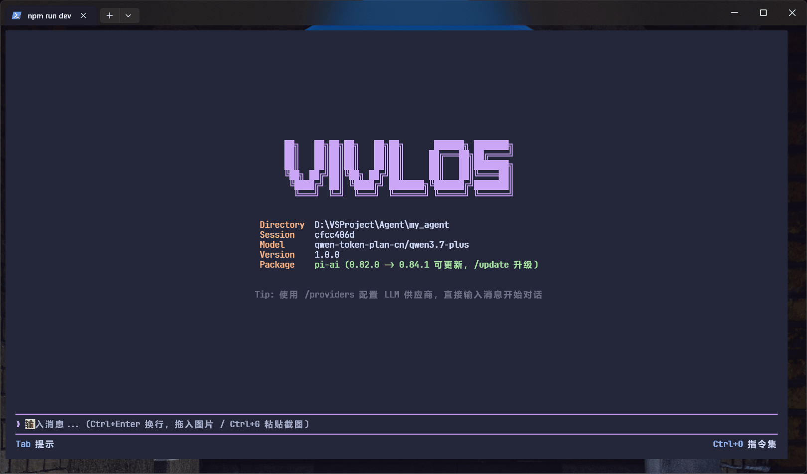
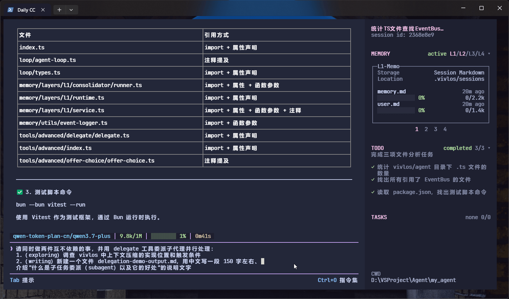
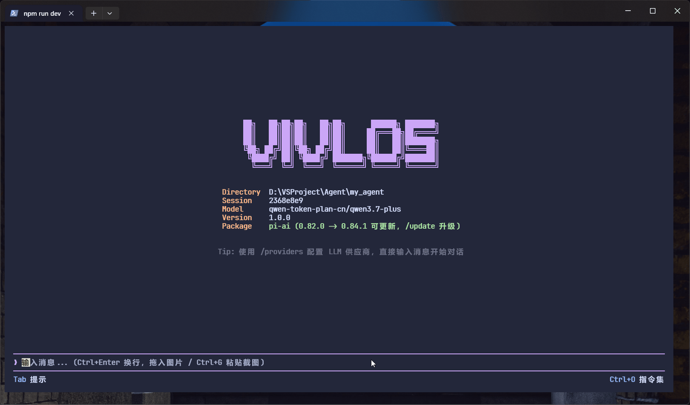
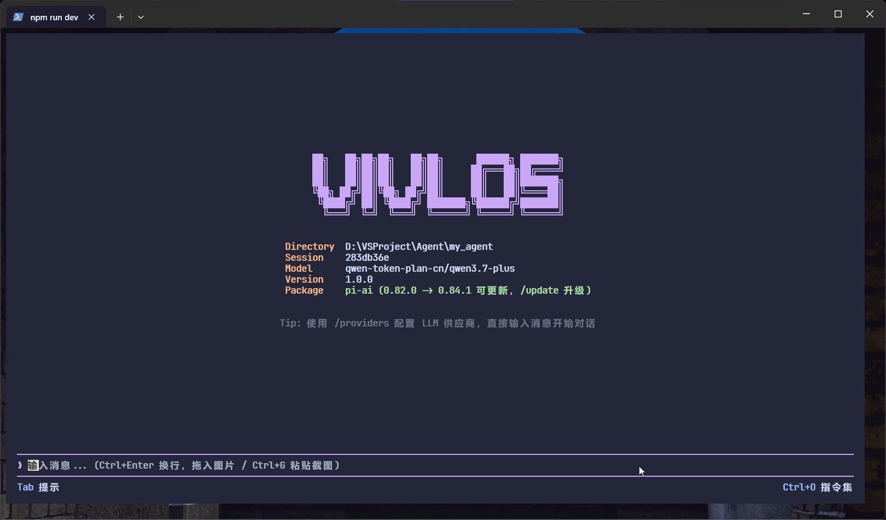
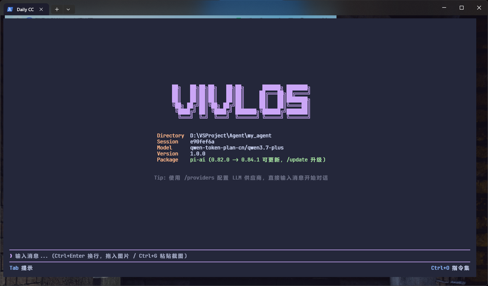
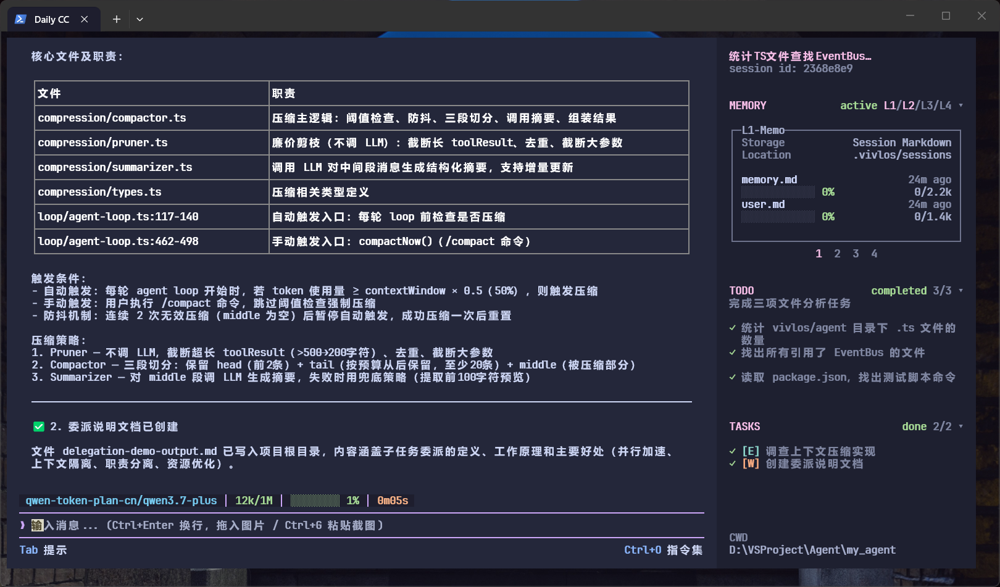

<div align="center">

# Vivlos

基于 Bun、TypeScript 与 OpenTUI 构建的本地通用终端 Agent。

<p>
  
  
  
  <a href="./LICENSE"></a>
</p>

</div>

Vivlos 面向希望在终端中使用大模型（LLM）完成信息检索、文件处理、任务规划和多步骤操作的用户。它将模型调用、工具执行、会话管理、上下文压缩与可控记忆整合在同一个终端界面中，并通过清晰的运行时边界保留本地状态。

> [!IMPORTANT]
> Vivlos 当前处于早期开发阶段，暂未发布稳定安装包。本仓库现阶段仅提供源码运行方式，接口、配置和交互仍可能调整。

## 效果演示

| 功能 | 演示 |
| --- | --- |
| 流式输出对话 |  |
| 子任务委派（Subagent） |  |
| Todo List 生成 |  |
| 多模型支持 |  |
| 跨会话记忆 |  |
| 主界面 |  |
| 会话界面 |  |

## 目录

- [效果演示](#效果演示)
- [主要能力](#主要能力)
- [快速开始](#快速开始)
- [模型与配置](#模型与配置)
- [技术栈](#技术栈)
- [项目结构](#项目结构)
- [本地数据](#本地数据)
- [常用命令](#常用命令)
- [项目文档](#项目文档)
- [开发状态](#开发状态)
- [参与开发](#参与开发)
- [许可证](#许可证)

## 主要能力

1. **终端交互界面**：基于 OpenTUI（终端 UI 框架）和 React 构建，支持流式回复、Thinking（思考过程）展示、Tool Call（工具调用）状态和请求中止。
2. **多模型接入**：通过 pi-ai（模型接入库）管理模型与凭证，支持切换 Provider（模型服务商）和 Model（模型），并可添加 OpenAI Compatible 或 Anthropic Compatible（兼容接口）服务。模型选择弹窗标注能力标签（文本/视觉），支持键入筛选。
3. **Agent 工具系统**：内置文件读取与写入、Shell（命令行）、目录浏览、文本搜索和文件查找等基础工具。
4. **Skill（技能）扩展**：按需加载 Skill 指引；内置 Tavily CLI 扩展可用于搜索、网页提取、站点映射、抓取和深度研究。
5. **会话管理**：支持新建、切换、删除、重命名和自动标题，并通过 JSONL（逐行 JSON 文件）恢复历史消息。
6. **上下文压缩**：支持自动压缩和手动 `/compact`，在长对话中保留关键事实、进度与后续步骤。
7. **分层 Memory（记忆）**：L1 使用 `memory.md` 和 `user.md` 保存当前会话的稳定事实；L2 通过 `session_search` 跨会话检索历史对话；L3 外部记忆服务与 L4 文件知识库已有设计、尚未实现。
8. **图片识别（多模态）**：拖入图片、粘贴图片路径或 Ctrl+G 读取剪贴板截图（Windows）作为附件发送；支持指定专用视觉模型，解析前通过交互式选项确认解析方式。
9. **子任务委派（Subagent）**：主模型可经 `delegate` 工具将 1-2 个子任务派发给独立上下文的子代理并行执行。子代理分 `exploring`（只读探索，仅 read/ls/grep/find/skill）与 `writing`（可写实现）两类，用过滤后的专属工具集独立运行，完成后返回结构化摘要。委派卡片实时展示进度（轮次/当前工具），点击任务行钻取子会话对话，按 ↑ 返回主会话；侧边栏 TASKS 区块展示全部委派任务状态。
10. **运行中插话（Steering）**：Agent 运行中继续发送的消息会进入 steering 队列并以 QUEUED 卡片展示，在回合边界自动注入供模型据此纠偏；因中止/报错未注入时标记为"未发送"。
11. **任务规划**：提供结构化 Todo List（待办清单）、状态推进和侧栏查看，并支持交互式选项确认。
12. **本地持久化**：Provider、Model、凭证和自定义服务配置保存在本地 SQLite（嵌入式数据库）；Session（会话）、Memory 与 Todo 保存在当前工作目录。
13. **运行时控制**：提供重试、最大轮次、Bash 权限和压缩策略等配置边界。

## 快速开始

### 环境要求

- [Bun](https://bun.sh/) 1.3 或更高版本
- 支持现代终端控制能力的终端程序
- 至少一个可用的 LLM Provider API Key（模型服务商的接口凭证）

### 获取源码

```bash
git clone https://github.com/LunaticPum/vivlos.git
cd vivlos
bun install
```

### 配置环境变量

PowerShell：

```powershell
Copy-Item .env.example .env
```

Bash：

```bash
cp .env.example .env
```

在 `.env` 中填写需要使用的 Provider：

```dotenv
DEEPSEEK_API_KEY=your-api-key
VIVLOS_DEFAULT_PROVIDER=deepseek
VIVLOS_DEFAULT_MODEL=your-model-id
```

也可以启动 Vivlos 后，在终端界面中选择 Provider、Model 或添加兼容服务。

### 启动

```bash
bun run dev
```

Vivlos 会以执行命令时的目录作为当前 Workspace，并在该目录下创建 `.vivlos/` 运行数据目录。

## 模型与配置

Vivlos 使用 pi-ai 提供模型目录和调用能力。内置 Provider 的可用模型取决于当前 pi-ai 版本与所配置的凭证。

配置来源按职责分为三类：

| 配置来源 | 用途 |
| --- | --- |
| `.env` | Provider API Key、默认 Provider 和默认 Model |
| `<workspace>/.vivlos/config.json` | 重试、压缩、Memory 容量与 Bash 权限等运行参数 |
| `<workspace>/.vivlos/vivlos.db` | 当前模型、凭证、自定义 Provider 和最近使用记录 |

API Key 和本地运行数据不应提交到版本控制。仓库已默认忽略 `.env` 与 `.vivlos/`。

## 技术栈

| 模块 | 技术 |
| --- | --- |
| Runtime（运行时） | Bun |
| 语言 | TypeScript |
| 终端界面 | OpenTUI、React |
| Agent Loop（智能体主循环） | pi-agent-core |
| 模型接入 | pi-ai |
| 本地数据库 | `bun:sqlite` |
| 结构化配置 | JSON、YAML、dotenv |
| 测试 | Bun Test、Vitest |

## 项目结构

```text
vivlos/
├── entries/opentui/       # OpenTUI 应用入口与界面
├── agent/
│   ├── loop/              # Agent Loop、重试与终止控制
│   ├── prompt/            # System Prompt 构建与模板
│   ├── session/           # Session 生命周期与历史记录
│   ├── memory/            # Session Memory 与 Consolidator
│   ├── compression/       # 上下文剪枝、摘要与压缩
│   ├── tools/             # Builtin 与 Advanced Tools
│   ├── skills/            # Skill 注册与扩展
│   ├── delegation/        # 子任务委派（Subagent）运行器与工具策略
│   └── steering/          # 运行中插话（消息队列/纠偏）队列
├── infra/
│   ├── llm/               # Provider、Model 与 Credential
│   ├── storage/           # SQLite、Session 与 Memory 存储
│   ├── eventbus/          # 应用事件总线
│   ├── config/            # 运行时配置
│   ├── logger/            # 本地日志
│   ├── clipboard/         # 剪贴板截图读取
│   ├── credentials/       # 凭证存储
│   ├── sandbox/           # 隔离执行环境（占位）
│   └── scheduler/         # 后台任务调度（占位）
├── shared/                # Result、错误与通用能力
└── tests/                 # 逻辑与集成测试
```

## 本地数据

Vivlos 的运行数据默认位于当前 Workspace（工作目录）的 `.vivlos/`：

```text
.vivlos/
├── config.json            # Workspace 运行配置
├── vivlos.db              # Provider、Model 与凭证数据
├── memory.db              # L2 历史会话索引（可删除重建）
├── sessions/
│   └── <session-id>/
│       ├── history.jsonl  # 对话与 Tool Result
│       ├── memory.md      # 项目和环境记忆
│       ├── user.md        # 用户偏好
│       └── todos.json     # 当前 Todo List
└── temp/                  # 临时文件
```

L1 Memory 和 Todo 当前均以 Session 为边界，不承诺跨 Session 自动继承；跨 Session 的历史细节可通过 `session_search`（L2）按需检索。

## 常用命令

```bash
# 启动开发环境
bun run dev

# TypeScript 检查
bun run typecheck

# 运行当前逻辑测试
bun run test
```

## 项目文档

完整目录见 [Vivlos 文档](./docs/README.md)。

| 文档 | 内容 |
| --- | --- |
| [使用指南](./docs/使用指南.md) | 源码启动、模型配置、终端操作和本地数据 |
| [整体架构](./docs/整体架构.md) | 分层结构、核心模块和请求链路 |
| [智能体运行机制](./docs/智能体运行机制.md) | Prompt、Agent Turn、Tool Call、重试与终止语义 |
| [上下文与会话](./docs/上下文与会话.md) | Session、History、上下文组装和压缩机制 |
| [记忆机制](./docs/记忆机制.md) | L1-L4 四层 Memory 目标设计与当前实现 |
| [任务规划](./docs/任务规划.md) | Todo、子任务委派和 Offer Choice |
| [工具与技能](./docs/工具与技能.md) | Tool 协议、权限、Builtin/Advanced Tools 和 Skill |

早期研究与旧版方案已集中到 [历史归档](./docs/归档/)，不代表当前行为。

## 开发状态

当前重点是完善本地终端 Agent 的核心闭环，包括模型对话、工具执行、会话恢复、上下文压缩、Memory、Todo 与 Provider 管理。

以下目录或能力仍处于占位、实验或后续设计阶段，不应视为稳定功能：

- QQ 与其他消息入口
- Sandbox 与隔离执行环境
- Scheduler 与后台任务
- 委派子会话落盘 / resume / 后台模式
- L3/L4 Memory 的 Provider 与知识库实现
- 跨平台安装包与容器部署

## 参与开发

欢迎通过 Issue 讨论问题、功能设计与文档改进。提交修改前建议先说明目标和行为边界，避免在尚未稳定的模块上引入重复抽象。

开发时请保持改动范围清晰，并至少完成相关逻辑验证与 TypeScript 检查。

## 许可证

Vivlos 使用 [MIT License](./LICENSE)。
