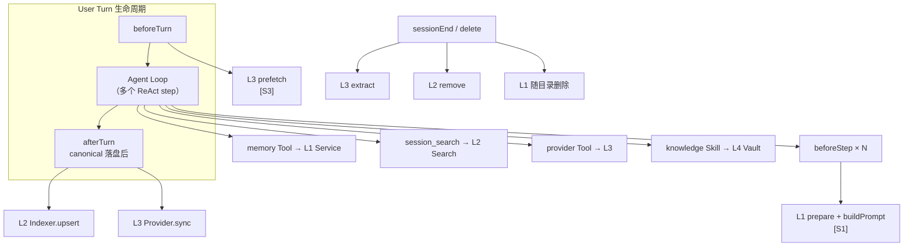
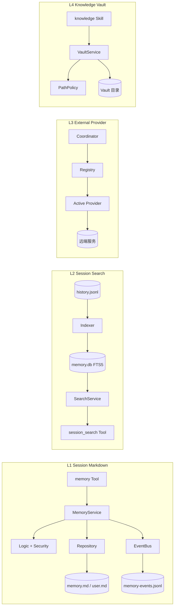

# Memory 架构管线

> 本文是 Memory（记忆）模块的施工图：回答"哪段逻辑在什么时机运行、依赖谁、产出什么数据、遵守哪份规范（Spec）"。四层设计总览见 [记忆机制](../记忆机制.md)，公共规则见 [S0](./S0-Memory公共约束.md)。

## 一句话定位

Memory 管线把四层记忆接到同一条生命周期上：**L1 每步在场，L2 事后入库按需搜，L3 可选外挂按轮同步，L4 显式任务才碰**。四层共用一套生命周期钩子（Hook，即生命周期回调点），但各自维护独立状态源。

## 总体管线

```text
User Turn 开始
    │
    ▼
┌──────────────────── MemoryCoordinator [S0] ────────────────────┐
│                                                                 │
│  beforeTurn（每个 User Turn 一次）                              │
│    ├─> L3 Provider.prefetch(query) ──> 瞬时 Context [S3]        │
│    └─> L4 无动作                                                │
│                                                                 │
│  beforeStep（每个 ReAct step 一次，现有 prepare 时机）          │
│    ├─> L1 Runtime.prepare() ──> Consolidator 检查 [S1]          │
│    └─> L1 Runtime.buildPrompt() ──> System Prompt [S1]          │
│                                                                 │
│  Agent Loop 运行中（模型按需调用）                              │
│    ├─> memory Tool ──────> L1 Service ──> memory.md/user.md     │
│    ├─> session_search ───> L2 Search ───> memory.db (FTS5)      │
│    ├─> provider Tool ────> L3 Provider ─> 远端服务              │
│    └─> knowledge Skill ──> L4 Vault ────> Vault 目录            │
│                                                                 │
│  afterTurn（canonical 消息落盘后，每个 User Turn 一次）         │
│    ├─> L2 Indexer.upsert(session) ──> memory.db [S2]            │
│    └─> L3 Provider.sync(turn) ──────> 远端服务 [S3]             │
│                                                                 │
│  sessionEnd / sessionDelete / shutdown                          │
│    ├─> L3 Provider.extract() [S3]                               │
│    ├─> L2 Indexer.remove(sessionId) [S2]                        │
│    └─> L1 随 Session 目录删除 [S1]                              │
└─────────────────────────────────────────────────────────────────┘
```



## 层内依赖方向

每层内部保持单向依赖：Tool/Skill 只做参数适配，Service 做编排，Logic 是纯函数，Storage 只管读写。

```text
L1 [S1]
  memory Tool -> MemoryService -> Logic(memory/consolidate) + Security
                     |                    |
                     +-> Repository -> memory.md / user.md
                     +-> EventBus -> event-logger -> memory-events.jsonl
  L1 Runtime -> Trigger -> Consolidator Runner -> consolidate Tool -> Service

L2 [S2]
  history.jsonl（权威源）
        |
        v
  Indexer -> l2-db (bun:sqlite + FTS5) <- SearchService <- session_search Tool
        ^                                        |
        +----------- 结果带 session/行号锚点 ----+

L3 [S3]
  Coordinator -> ProviderRegistry -> ActiveProvider（实现 MemoryProvider 接口）
                                          |-> prefetch / sync / extract
                                          |-> search / remove / export
  映射表 -> memory.db (l3_mappings)

L4 [S4]
  knowledge Skill -> VaultService -> PathPolicy + Security
                                   -> Vault 目录（Markdown 文件）
```



## 脚本职责与 Spec 对照

| 脚本（规划路径） | 职责 | Spec |
| --- | --- | --- |
| `agent/memory/coordinator.ts` | 生命周期钩子分发，连接四层 | S0 |
| `agent/memory/types.ts` | `MemoryContextItem` 等共享类型 | S0 |
| `agent/memory/security.ts` | 内容扫描、Prompt 转义（各层共用） | S0 |
| `agent/memory/layers/l1/runtime.ts` | L1 运行时（现 `runtime.ts` 归位） | S1 |
| `agent/memory/layers/l1/service.ts` | L1 唯一写入编排入口 | S1 |
| `agent/memory/layers/l1/memory.ts` | 主模型 add/replace/remove 纯逻辑 | S1 |
| `agent/memory/layers/l1/consolidate.ts` | Consolidator refine/merge 纯逻辑 | S1 |
| `agent/memory/layers/l1/prompt.ts` | L1 Prompt 区块渲染 | S1 |
| `agent/memory/layers/l1/consolidator/` | trigger / runner / prompt | S1 |
| `agent/memory/layers/l2/schema.ts` | FTS5 表结构与迁移 | S2 |
| `agent/memory/layers/l2/indexer.ts` | JSONL → 索引的幂等写入 | S2 |
| `agent/memory/layers/l2/search.ts` | 查询解析、结果裁剪 | S2 |
| `agent/memory/layers/l2/tokenize.ts` | CJK 索引/查询分词展开 | S2 |
| `agent/memory/layers/l3/types.ts` | `MemoryProvider` 接口 | S3 |
| `agent/memory/layers/l3/registry.ts` | Provider 注册与 Active 切换 | S3 |
| `agent/memory/layers/l3/providers/` | 具体 Adapter（首期为 null/mock） | S3 |
| `agent/memory/layers/l4/vault.ts` | Vault 读写编排 | S4 |
| `agent/memory/layers/l4/path-policy.ts` | Vault Root 包含与越界检查 | S4 |
| `agent/memory/utils/event-logger.ts` | `memory:operation` 落盘 | S1 |
| `agent/tools/advanced/memory/memory.ts` | L1 Tool 参数适配 | S1 |
| `agent/tools/advanced/session-search/` | L2 Tool 参数适配 | S2 |
| `agent/skills/builtin/knowledge/SKILL.md` | L4 Skill 入口 | S4 |
| `infra/storage/memory/repository.ts` | L1 Markdown 读写 | S1 |
| `infra/storage/memory/history.ts` | L1 操作历史与 cursor | S1 |
| `infra/storage/memory/l2-db.ts` | L2/L3 SQLite 连接与建表 | S2/S3 |

## 目录边界

### 代码目录

```text
vivlos/agent/memory/
├── index.ts                  # 公共导出
├── types.ts                  # 共享类型 [S0]
├── coordinator.ts            # 生命周期编排 [S0]
├── security.ts               # 共用安全 [S0]
├── layers/
│   ├── l1/                   # [S1] runtime/service/logic/prompt/consolidator
│   ├── l2/                   # [S2] schema/indexer/search
│   ├── l3/                   # [S3] types/registry/providers
│   └── l4/                   # [S4] vault/path-policy
└── utils/
    └── event-logger.ts

vivlos/agent/tools/advanced/
├── memory/                   # L1 Tool [S1]
└── session-search/           # L2 Tool [S2]

vivlos/agent/skills/builtin/
└── knowledge/SKILL.md        # L4 入口 [S4]

vivlos/infra/storage/memory/
├── repository.ts             # L1 Markdown [S1]
├── history.ts                # L1 审计历史 [S1]
└── l2-db.ts                  # L2/L3 SQLite [S2/S3]
```

### 数据目录

```text
<workspace>/.vivlos/
├── memory.db                 # L2 索引（可重建）+ L3 映射表
├── vault/                    # L4 知识库根目录（可配置）
└── sessions/<时间戳>_<id>/
    ├── history.jsonl         # L2 权威源
    ├── memory.md             # L1
    ├── user.md               # L1
    ├── memory-events.jsonl   # L1 审计
    └── memory-cursor.json    # L1 Consolidator 游标
```

边界规则：

- `memory.db` 是纯索引，任何时候可以从 `sessions/*/history.jsonl` 全量重建，删除不丢数据。
- L1 文件只属于单个 Session 目录；跨 Session 的稳定信息走 L2 检索或 L3，不改 L1 的作用域。
- Vault 独立于 Session，删除 Session 不影响 Vault。

## 依赖约束

- Logic 与 Security 是纯函数，不访问文件系统、不发事件。
- Tool/Skill 层不直接碰 Storage，一律经 Service。
- Coordinator 不实现任何层的业务规则，只做钩子分发和失败隔离（某层失败不影响主对话）。
- L2/L3/L4 的召回结果统一包装为 `MemoryContextItem`（见 S0），作为不可信数据进入上下文。
