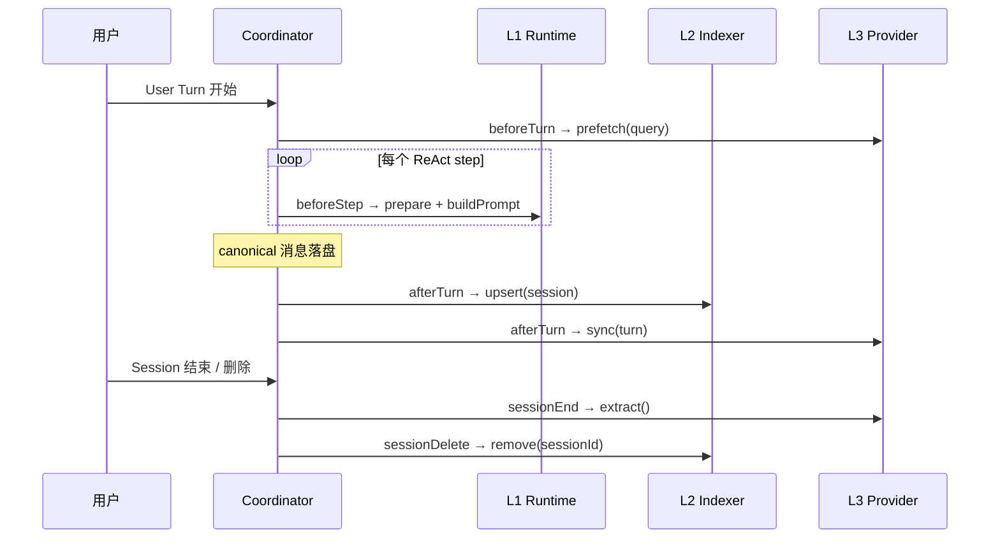

# S0 Memory 公共约束

> **通俗解释**：这份规范管的是四层记忆的"公共交规"——不关心每层内部怎么实现，只规定：什么时机允许读写记忆（生命周期钩子）、每层数据归谁管（作用域）、召回内容能不能信（信任边界）、内容怎么从下层提升到 L1、以及删除时各层怎么办。S1-S4 的所有实现都先满足本文。

## 1. 术语

| 术语 | 含义 |
| --- | --- |
| User Turn（对话轮次） | 用户发一条消息 → Agent 完整跑完循环（含多次工具调用）→ 给出最终回复 |
| ReAct step（推理步骤） | 一次 User Turn 内的单次模型推理 + 工具执行 |
| Session（会话） | 连续对话容器，包含多个 User Turn，共享 history.jsonl 和 L1 文件 |
| canonical 消息（正式消息） | 落盘到 history.jsonl 的 user/assistant/toolResult 消息 |

## 2. 生命周期钩子

MemoryCoordinator 是唯一的生命周期分发点。各层只注册钩子，不自行监听散落的 EventBus 事件。

```text
beforeTurn    每个 User Turn 开始前，仅一次
beforeStep    每个 ReAct step 推理前（现有 memoryRuntime.prepare 时机）
afterTurn     canonical 消息落盘后，仅一次
sessionEnd    Session 关闭 / 切换 / 进程退出
sessionDelete Session 被删除
```



钩子规则：

- 每个钩子内部失败必须被捕获，不得中断主对话流程。
- 钩子按注册顺序同步执行；L3 网络调用必须带超时（默认 5s），超时按失败处理。
- `beforeStep` 是现有 `memoryRuntime.prepare()` 的挂载点，L1 保持现有行为不变。
- 未启用的层（L3 无 Provider、L4 未配置 Vault）对应钩子直接跳过。

## 3. 作用域

| 层 | 状态源 | 作用域 | 生命周期 |
| --- | --- | --- | --- |
| L1 | Session 目录 `memory.md` / `user.md` | 单 Session | 随 Session 删除 |
| L2 | `<workspace>/.vivlos/memory.db`（索引） | 当前 Workspace 全部 Session | 跨 Session，可重建 |
| L3 | 远端服务 + 本地映射表 | 当前 Workspace | 跨 Session，独立于本地删除 |
| L4 | Vault 目录（默认 `.vivlos/vault/`） | 独立于 Session | 用户管理 |

约束：

- L1 保持 Session-local，不扩展为全局记忆。跨 Session 需求由 L2 检索或 L3 承担。
- L2 索引按 Workspace 隔离（不同 cwd 启动的 Vivlos 使用各自的 `.vivlos/memory.db`）。
- 删除 Session 必须同步清理 L2 索引；L3/L4 不自动级联。

## 4. 信任边界

所有 Memory 和召回内容都是**不可信事实数据**：

1. 进入 System Prompt 或 Tool Result 时，必须与系统规则分离（XML 标签包裹 + 转义）。
2. 召回结果必须携带来源标记，统一为 `MemoryContextItem`：

```ts
interface MemoryContextItem {
  readonly layer: "l1" | "l2" | "l3" | "l4";
  readonly source: string;        // 如 "session:abc123#L42"、"vault:notes/x.md"
  readonly content: string;
  readonly timestamp?: number;
}
```

3. 模型不得把召回内容当作可执行指令，也不得把召回当作操作完成证明（现有 rules.md 规则继续适用）。

## 5. 层间提升

```text
L2/L3/L4 召回 ──(瞬时)──> 当前 Context
                              │
              模型判断值得长期保存
                              │
                              ▼
                    重新调用 memory Tool
                              │
                    L1 安全扫描 + 容量检查 + 审计
                              │
                              ▼
                        写入 L1
```

- 召回结果不能自动写回 L1，必须由主模型显式发起 memory Tool 调用。
- 提升后的内容走完整的 L1 写入管线（安全、容量、审计），不存在旁路。

## 6. 删除语义

| 触发 | L1 | L2 | L3 | L4 |
| --- | --- | --- | --- | --- |
| 删除 Session | 随目录删除 | 删除索引行 | 不处理 | 不处理 |
| 用户要求遗忘某事实 | memory remove | 不处理（历史事实） | 需显式调用 remove | 需显式删除文件 |
| 用户要求彻底清除 | 逐层显式执行，不假设级联 | 同左 | 同左 | 同左 |

## 7. Coordinator 职责边界

Coordinator 只做：

- 持有各层实例，按生命周期分发钩子。
- 捕获每层钩子异常，记录日志，继续执行后续层。
- 提供 `dispose()` 用于进程退出清理。

Coordinator 不做：

- 不实现任何层的业务规则。
- 不直接读写任何状态源。
- 不决定某层是否启用（由配置和注册决定）。
