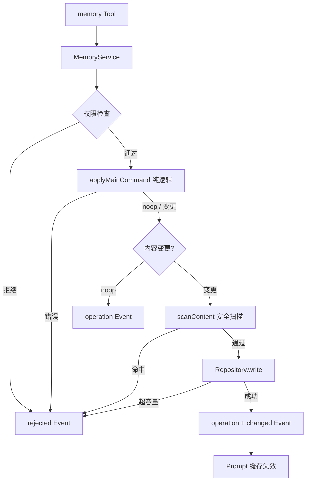

# S1 L1 会话记忆规范

> **通俗解释**：L1 是当前 Session（会话）的"便签纸"——少量关键事实直接贴在 System Prompt（系统提示词）里，模型每一步都能看见。触发场景：用户说"记住 X / 改成 Y / 忘掉 Z"时主模型调用 memory 工具；条目太多快超容量时 Consolidator（记忆整理器）自动精简。L1 已完整实现，本规范固化现有行为并明确目录归位后的边界。

## 1. 数据结构

每个 Session 目录两个文件，条目用独立 `---` 行分隔：

- `memory.md`：项目事实、环境、约定、稳定决策（默认上限 2200 字符）。
- `user.md`：用户偏好与画像（默认上限 1375 字符）。

辅助文件：`memory-events.jsonl`（操作审计，best-effort）、`memory-cursor.json`（Consolidator 游标）。

## 2. 写入管线

唯一写入路径：`memory Tool → MemoryService → Logic + Security → Repository → Markdown`。

```text
memory Tool 调用
    │
    ▼
参数校验（action 必需字段、remove 需 reason）
    │
    ▼
MemoryService.executeMain()
    ├─ checkPermission(main, action)
    ├─ applyMainCommand()          # 纯逻辑：去重 / 子串匹配 / 构造新条目列表
    ├─ scanContent(after)          # 注入 / 凭证 / 隐藏字符 / 分隔符
    ├─ Repository.write()          # 容量检查 + 写盘 + 重读 revision
    └─ EventBus: memory:operation [+ memory:changed]
```



操作语义：

| action | 规则 |
| --- | --- |
| `add` | 完全相同条目 → 成功 no-op；否则追加 |
| `replace` | `oldText` 子串唯一匹配才执行；0 条或多条命中均拒绝 |
| `remove` | 同 replace 匹配规则；仅用户明确要求遗忘时使用 |

## 3. Prompt 注入

- L1 在 `beforeStep` 时机构建为 XML 区块，内容经 `escapeForPrompt()` 转义。
- 两文件均为空时不注入 Memory 区块。
- `memory:changed` 使当前 Session 的 PromptBuilder 失效；同一 User Turn 的下一个 ReAct step 读取新值，进行中的单次模型请求不受影响。

## 4. Consolidator

低频受限整理 Agent，仅 `refine`（精简单条）和 `merge`（合并多条），不能新增、删除或改写事实。

```text
beforeStep → prepare()
    ├─ 读 cursor + 操作历史 + snapshot
    ├─ checkTrigger（20 次 committed 操作 / 85% 容量 / 显式请求）
    └─ 触发 → resolveModel → Runner.run（受限 agentLoop）
                 ├─ consolidate Tool → Service.executeConsolidation
                 └─ completed 才推进 cursor
```

约束：独立 maxTurns / maxTools / timeoutMs；失败、中止、模型缺失均保留旧 cursor。

## 5. 安全

写入前扫描（`security.ts`，各层共用）：

- Prompt Injection 与伪造系统标记。
- Credential 模式（SSH 私钥头、`sk-` 长密钥、`api_key`/`password`/`secret` 赋值、AWS Key）。
- 不可见 Unicode 与控制字符。
- 条目分隔符注入（独立 `---` 行）。

rejected 操作留结构化 Event，但候选恶意内容不落盘。

## 6. 生命周期

- Pending Session 不创建文件；首次请求激活时创建。
- Session 切换重置 L1 Runtime；删除 Session 随目录删除。
- 新 Session 不继承旧 Session 的 L1（跨 Session 走 L2/L3）。

## 7. 目录归位

现有 `agent/memory/` 顶层文件迁入 `agent/memory/layers/l1/`，顶层腾给 Coordinator 与共享类型（见 [架构管线](./Memory架构管线.md)）。迁移只移动文件与 import 路径，不改行为。
