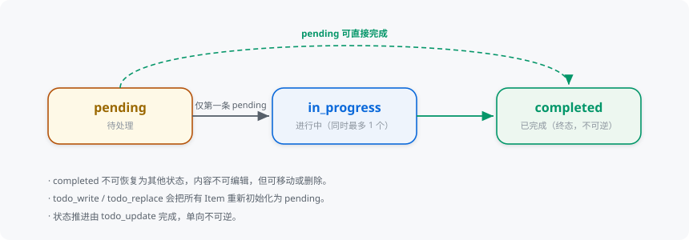
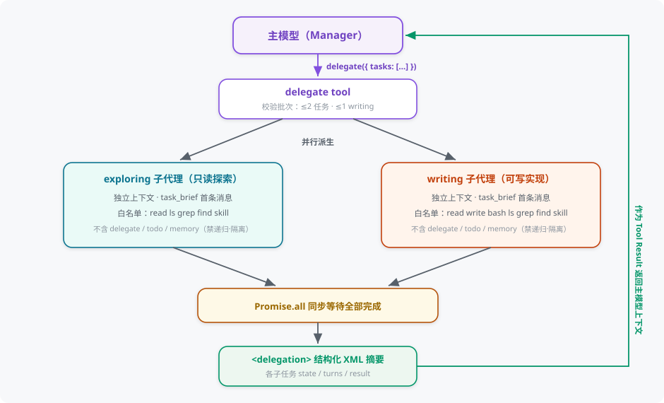
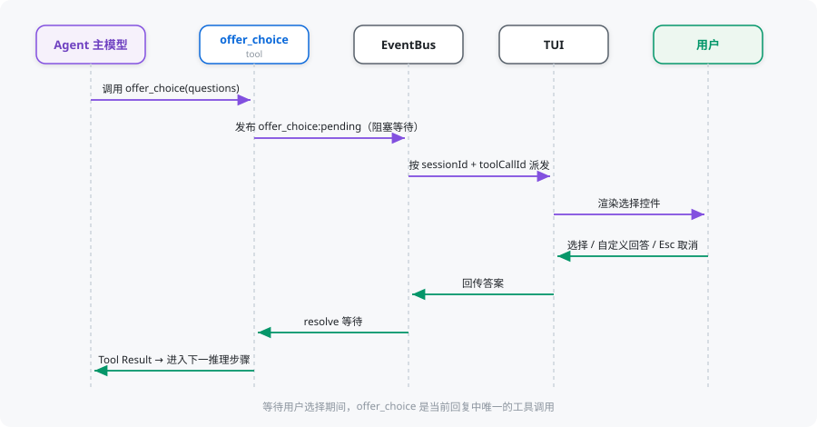

# 任务规划

Vivlos 使用 Todo（待办清单）、委派（Delegation）和 Offer Choice（交互式选项）处理三类问题：当前 Session（会话）的执行进度、需要独立上下文并行推进的子任务，以及需要由用户做出的交互决策。

## 职责边界

| 能力 | 用途 | 生命周期 | 当前状态 |
| --- | --- | --- | --- |
| Todo | 当前 Session 的多步骤执行计划 | Session-local（会话内有效） | 已实现 |
| 委派（Delegation） | 把 1-2 个子任务派发给独立上下文的子代理并行执行 | 当前工具调用（子代理为内存态） | 已实现 |
| Offer Choice | 等待用户选择或补充输入 | 当前工具调用 | 已实现 |

Todo 不替代委派，也不写入 Memory（记忆）。Memory 保存稳定事实与偏好，不负责跟踪执行状态。

## Todo List

每个 Session 最多保存一个 Todo List，存储在 `todos.json`，最多包含 10 个 Item（清单项）。

```text
TodoList
├── description
├── status
├── pendingList
├── inProgressOrderNum
└── items[]
```

Item 包含：

- `orderNum`：连续顺序号。
- `content`：任务内容。
- `status`：`pending`（待处理）、`in_progress`（进行中）或 `completed`（已完成）。
- `priority`：可选的 `high`、`medium` 或 `low`。

## Todo 状态模型

允许的状态变化：



规则：

- 同时最多有一个 `in_progress` Item。
- 只有第一条 `pending` 可以进入 `in_progress`。
- `pending` 可以被直接完成。
- `completed` 不可恢复为其他状态。
- `completed` 不可编辑内容，但可以移动或删除。
- `write` 和 `replace` 会把所有 Item 重新初始化为 `pending`。

## 六个 Todo Tool

| Tool | 作用 |
| --- | --- |
| `todo_read` | 读取当前完整 List |
| `todo_write` | 在不存在 List 时创建 |
| `todo_replace` | 完整替换已有 List |
| `todo_delete` | 删除整个 List |
| `todo_modify` | 编辑、移动、插入或删除 Item |
| `todo_update` | 单向推进 Item 状态 |

`todo_write` 和 `todo_replace` 要求 `items` 为真实 JSON 数组。运行时可以兼容合法的字符串化数组，但损坏的 JSON 会作为工具错误回灌模型，不做猜测修复。

## Todo Context 与 Sidebar

每次 User Turn（对话轮次）前，当前 Todo 会被转换成临时 Hint（提示信息）交给模型，使后续执行能看到最新顺序和状态。

Hint 不写入 `history.jsonl`，Tool Result（工具结果）才是 Todo 更新成功的依据。

Sidebar（侧栏）目前提供只读查看：

- Session 切换时加载对应 Todo。
- `todo:updated` 事件后实时刷新。
- 展示 List 状态、优先级和 Item 进度。

用户暂时不能直接在 Sidebar 中创建、编辑或排序 Todo，这些操作由 Agent 工具完成。

## 委派（Delegation）

主模型可经 `delegate` 工具把 1-2 个子任务派发给**独立上下文**的子代理并行执行，同步等待全部完成后取回结构化摘要。它解决的是"某段子任务会大量占用主上下文、或可并行推进"的问题，而不是跨 Session 的长期目标管理。



### 任务类别与工具白名单

子代理按类别获得过滤后的专属工具集，均不含 `delegate` / `todo` / `memory` / `offer_choice` / `session_search`（禁止递归派生、隔离计划与记忆）：

| 类别 | 定位 | 工具白名单 |
| --- | --- | --- |
| `exploring` | 只读探索：检索与阅读代码、整理发现 | `read` `ls` `grep` `find` `skill` |
| `writing` | 可写实现：编写代码、运行命令、完成改动 | `read` `write` `bash` `ls` `grep` `find` `skill` |

### 批次约束

- 每批最多 2 个子任务，且最多 1 个 `writing`（并发写同一代码库会互相覆盖）。
- 子代理看不到主会话，`brief` 必须自包含目标、范围与期望返回；`context` 传已确认事实与约束，`references` 传文件路径。
- 每个子代理有独立的轮次上限与超时，超限以 `turn_limited` / `timeout` 等状态标记并保留部分结果。

### 执行与返回

- 子任务经 `Promise.all` 真并行执行，工具同步等待全部终态（成功、受限、超时、中止、错误）。
- 返回 `<delegation>` 结构化 XML 摘要，逐任务携带 `state` / `turns` / `result` / `error`，作为 Tool Result 回灌主模型。
- 子代理为内存态，不落盘；其执行过程经事件推送，供 TUI 委派卡片实时展示。

### TUI 呈现

- 委派卡片四阶段渲染：规划 → 已委派 n 个子任务 → 任务行实时进度（轮次/当前工具）→ 终态。
- 点击任务行可**钻取**该子代理的会话对话，按 `↑` 返回主会话。
- 侧边栏 TASKS 区块汇总当前 Session 的全部委派任务状态。

> [!NOTE]
> 委派子会话的落盘、resume 与后台模式尚未实现，当前子代理为纯内存态、随工具调用结束即释放。

## Offer Choice

Offer Choice 用于模型不能自行决定、需要等待用户回答的场景。

当前支持：

- 一次展示 1 至 4 个问题。
- 每题提供 2 至 6 个单选项。
- TUI（终端界面）自动提供自定义回答入口。
- 分页选择和返回修改。
- Esc 取消确认与 Ctrl+C 中止。

执行流程：



等待用户选择期间，Offer Choice 是当前回复中唯一的工具调用，避免其他工具并行改变状态。

## 选择原则

- 当前会话中的多步骤工作使用 Todo。
- 需要独立上下文或可并行的子任务使用委派（Delegation）。
- 稳定事实、环境和用户偏好使用 Memory。
- 需要用户做出明确选择时使用 Offer Choice。
- 简单问题或单步操作不需要为了形式创建计划。
