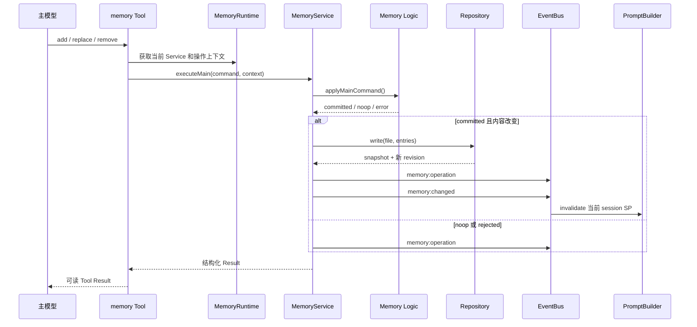
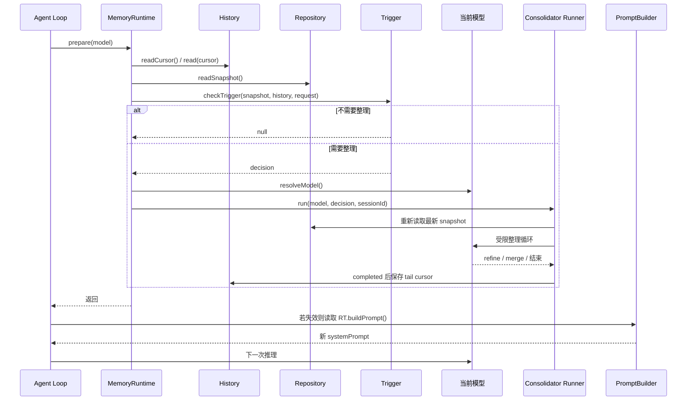

# Memory 模块逻辑调用说明

> [!CAUTION]
> 本文档为阶段性调用记录，已经归档。当前设计请阅读 [记忆机制](../记忆机制.md)。

本文说明当前 Memory 模块的对外接口、主要类型、脚本职责和调用顺序。

## 1. 对外接口

公共出口：`vivlos/agent/memory/index.ts`

```ts
createL1(source)
createMemoryRuntime(deps)
createMemoryService(deps)
```

主要类型：

```ts
MemoryRuntime
MemoryRuntimeDeps
MemoryService
MemoryServiceResult
MemoryServiceValue
MemoryServiceError
MemoryOperationContext
MainMemoryCommand
ConsolidationMemoryCommand
MAIN_MEMORY_REASON_CODES
```

### MemoryRuntime

```ts
interface MemoryRuntime {
  readonly sessionId: string;
  getService(): MemoryService;
  buildPrompt(): string;
  getOperationContext(
    command: MainMemoryCommand,
    reasonCode?: string,
    reason?: string,
  ): MemoryOperationContext;
  recordMainResult(
    command: MainMemoryCommand,
    result: MemoryServiceResult,
  ): void;
  requestConsolidation(): void;
  prepare(model: Model<Api>, signal?: AbortSignal): Promise<void>;
  reset(): void;
}
```

调用方主要是：

- 主组合根：创建 Runtime、Service 和 Event Logger。
- 主 Memory Tool：通过 Runtime 获取当前 session 的 Service 和操作上下文。
- Agent Loop：在首次推理前和下一轮推理前调用 `prepare()`，并在需要时调用 `buildPrompt()`。

## 2. 脚本职责

| 脚本 | 职责 |
|---|---|
| `types.ts` | Memory actor、action 和主模型原因代码等共享类型。 |
| `security.ts` | 内容安全扫描、权限检查、Prompt XML 转义。 |
| `memory.ts` | 主模型 `add/replace/remove` 纯逻辑，不读文件。 |
| `consolidate.ts` | Consolidator `refine/merge` 纯逻辑，不读文件。 |
| `service.ts` | 连接权限、Logic、Repository 和 EventBus，是 Memory 写入入口。 |
| `layers/l1.ts` | 把当前 snapshot 渲染成 Memory SP 数据块，不缓存、不写盘。 |
| `runtime.ts` | 按当前 session 绑定 Repository、History、Service、Runner 和 Trigger。 |
| `consolidator/prompt.ts` | 构造 Consolidator 的固定规则和最小动态输入。 |
| `consolidator/trigger.ts` | 根据请求、容量和操作数量判断是否需要整理。 |
| `consolidator/runner.ts` | 使用受限 `agentLoop()` 执行一次整理，并管理 cursor。 |
| `utils/event-logger.ts` | 把 `memory:operation` 追加到 session JSONL。 |
| `index.ts` | 对外导出公共工厂和类型。 |
| `agent/tools/advanced/memory/memory.ts` | 把模型 Tool 参数转换为主 Memory 命令，并格式化结果。 |
| `agent/tools/advanced/memory/consolidate.ts` | 只向整理模型暴露 `refine/merge`。 |
| `infra/storage/memory/repository.ts` | 读写当前 session 的 `memory.md/user.md`，计算 usage 和 revision。 |
| `infra/storage/memory/history.ts` | 读取操作历史和保存整理 cursor。 |
| `infra/llm/provider.ts` | 解析当前主模型或配置指定的整理模型。 |
| `agent/session/manager.ts` | 提供当前 session ID、目录和 session 切换。 |
| `agent/loop/agent-loop.ts` | 把 Memory Runtime 接入主 Agent Loop 和 `prepareNextTurn`。 |
| `entries/opentui/main.tsx` | 创建 EventBus、Session、Runtime、Logger、Tool 和 Agent。 |

## 3. 主要依赖关系

```text
主 Agent Loop
  -> MemoryRuntime
      -> MemoryRepository
      -> History
      -> MemoryService
          -> Security
          -> memory.ts / consolidate.ts
          -> MemoryRepository
          -> EventBus
      -> Trigger
      -> Runner
          -> Prompt
          -> consolidate Tool
          -> MemoryService

主 memory Tool
  -> MemoryRuntime.getService()
  -> MemoryService.executeMain()

L1 renderer
  -> MemoryRepository.readSnapshot()
  -> Security.escapeForPrompt()

Event Logger
  -> EventBus memory:operation
  -> 当前 session memory-events.jsonl
```

依赖边界：

- Logic 和 Security 不访问文件系统。
- Tool 不直接访问 Repository。
- Runtime 不直接实现 Memory 业务规则。
- Runner 不读取配置文件或凭证，只接收已解析模型和运行参数。
- Event Logger 不决定操作成功与否。
- TUI 只通过 Agent、EventBus 和后续明确的展示接口接入，不参与 Memory 业务判断。

## 4. 主模型写入顺序



## 5. 下一轮推理和整理顺序



### 关键规则

- `memory:changed` 只使同一个 session 的 PromptBuilder 失效。
- 只有 Runner `completed` 才推进 cursor。
- `failed`、`aborted`、`busy`、模型解析失败都保留旧 cursor。
- 主模型 add 遇到 `capacity_exceeded` 时只记录一次整理请求。
- 整理完成后不自动重放旧 add，由主模型根据原 Tool Result 决定是否重试。
- 空 Memory 不启动整理。
- TUI 不在本模块内承担 Memory 状态转换或业务判断。
