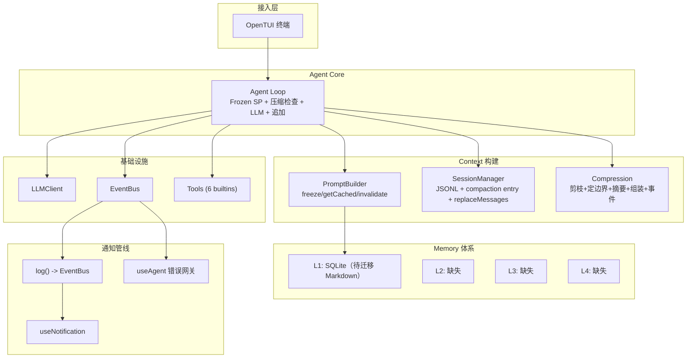
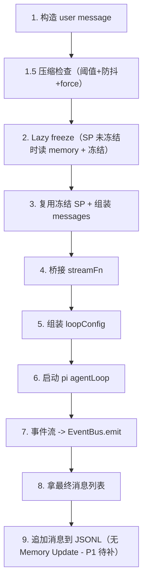
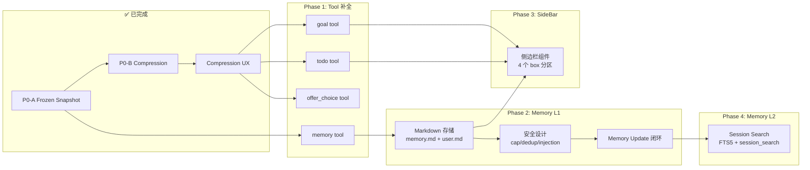

# Vivlos Agent 架构

> [!CAUTION]
> 本文档为历史设计记录，已经过时，不代表当前 Vivlos 实现。

> 基于 `01-arch.md`（Hermes 架构详解）和 `02-memory.md`（Hermes Memory 四层体系）的深度研读。
>
> **更新历史**：初版对比分析 -> P0-A/P0-B 完成 -> Compression UX 完成 -> 长期目标规划

---

## 〇、项目定位

**Vivlos** 是一个自托管个人 AI Agent，参照 Hermes Agent（Nous Research）的架构思想，以 TUI 为首要入口，逐步扩展多渠道。

核心设计原则：

1. **Session vs Turn 两层时间尺度**：Session 启动冻结 SP，Turn 复用冻结 SP + 组装消息
2. **Memory 四层叠加**：L1 Markdown 常驻 -> L2 全文检索 -> L3 External Provider -> L4 知识库
3. **File-first**：记忆、配置、会话均以文件持久化（Markdown / JSONL / JSON），人可读可审计
4. **EventBus 驱动**：底层事件经 EventBus 统一流转，TUI 层通过 hook 消费
5. **log() 机制盘活**：底层 log 经 EventBus 透传到 TUI 层显示，统一通知管线

---

## 一、Hermes 核心设计思想提炼

### 1. Session vs Turn 两层时间尺度（灵魂设计）

```
Session 启动 -> 读盘 -> 组装 SP -> 冻结快照（frozen snapshot）
                                    ↓
Turn 1 -> 复用冻结SP + 历史消息 -> LLM -> 回复 -> 写盘（SP不变）
Turn 2 -> 复用冻结SP + 历史消息 -> LLM -> 回复 -> 写盘（SP不变）
  ...
Session 结束 / 新Session -> 重读盘 -> 新快照
```

**为什么冻结**：保 provider 侧 prompt prefix cache + 避免每轮重读盘抖动前缀。
写入 memory 后当前 session 看不到（靠 tool result 看 live 状态），下个 session 才进 SP。
**用新鲜度换速度/成本**。

### 2. Memory 不是单点，是四层叠加

| 层  | 形态                        | 时机                                         | 解决什么           |
| --- | --------------------------- | -------------------------------------------- | ------------------ |
| L1  | memory.md + user.md（有界） | Session启动冻结进SP                          | 关键事实常驻       |
| L2  | state.db FTS5 全文索引      | 每Turn落库，Agent自主搜索                    | "上周聊过X吗"      |
| L3  | External Provider（mem0等） | per-turn prefetch/sync + session-end extract | 语义召回/身份建模  |
| L4  | Obsidian Skill              | 按需                                         | 项目级结构化知识库 |

**关键原则：四层 additive（叠加）不是 alternative（互斥）**。L1 配了 Provider 也不关。

### 3. Memory 的"隐形安全设计"才是它能用的关键

- **Cap as Feature**：硬上限逼 agent 策展（curate），不是 junk drawer
- **Duplicate = No-op**：LLM 爱 retry，重复 add 不报错但静默不插入
- **Injection Scanning**：写入前扫描 prompt injection / credential exfiltration
- **Save/Skip Policy**：出厂带"什么该记什么该跳过"，不需要额外 memory manager agent

---

## 二、Vivlos Agent 当前架构



### Agent Loop 当前步骤（P0-A/P0-B 后）



---

## 三、逐项对比分析

### 3.1 System Prompt 冻结 ✅ 已完成

| 维度         | Hermes           | Vivlos                              |
| ------------ | ---------------- | ----------------------------------- |
| SP 组装时机  | Session 启动一次 | ✅ freeze + getCached               |
| Memory 读取  | 启动时读一次冻结 | ✅ Lazy freeze                      |
| Prompt Cache | 充分利用         | ✅ SP 不变                          |
| 压缩后刷新   | explicit rebuild | ✅ invalidate + setCompactedHistory |

### 3.2 Compression ✅ 已完成

| 维度     | Hermes                   | Vivlos                       |
| -------- | ------------------------ | ---------------------------- |
| 触发     | 50% 阈值 + 安全网        | ✅ 阈值 + 防抖 + force       |
| 算法     | 剪枝->定边界->摘要->组装 | ✅ 完整四步                  |
| 摘要格式 | 8 段结构化 + 增量更新    | ✅ summary-template.md       |
| 失败处理 | 连续无效暂停 + 兜底      | ✅ maxConsecutiveNoOp + 兜底 |
| 持久化   | -                        | ✅ JSONL compaction entry    |
| 手动触发 | /compress                | ✅ /compact 命令             |
| 事件     | -                        | ✅ compaction:started/ended  |

### 3.3 Compression UX ✅ 已完成

| 维度     | 改造前                        | 改造后                               |
| -------- | ----------------------------- | ------------------------------------ |
| 通知来源 | 手动 notify() 散落            | ✅ 统一 log() -> EventBus            |
| 错误显示 | error state -> StatusBar prop | ✅ useAgent log("error") -> 瞬时通知 |
| 压缩动画 | 无                            | ✅ InfoBar 四态                      |
| 前置校验 | 无                            | ✅ 空会话/首轮/对话过短              |

### 3.4 Memory 体系（L1 雏形，待改造）

| 层  | Hermes                                          | Vivlos          | 状态               |
| --- | ----------------------------------------------- | --------------- | ------------------ |
| L1  | memory.md + user.md，cap，dedup，injection scan | SQLite memories | ⬜ 待迁移 Markdown |
| L2  | state.db FTS5 + session_search                  | 无              | ⬜ 缺失            |
| L3  | Provider ABC + 五件套                           | 无              | ⬜ 缺失            |
| L4  | Obsidian Skill                                  | 无              | ⬜ 缺失            |

### 3.5 Memory Update 闭环（缺失）

```
Hermes Loop: ... -> 最终回复 -> Memory Update 审视 -> 可能写 memory.md
Vivlos Loop: ... -> 最终回复 -> 追加消息到 session（无审视）
```

### 3.6 Memory Tool 安全设计（缺失）

| 安全特性           | Hermes              | Vivlos |
| ------------------ | ------------------- | ------ |
| Cap as Feature     | 硬上限逼策展        | 无     |
| Duplicate No-op    | 静默去重            | 无     |
| Injection Scanning | 写入前扫描          | 无     |
| Save/Skip Policy   | 出厂带策略          | 无     |
| substring 匹配     | replace/remove 子串 | 无     |

---

## 四、已完成工作总结

### P0-A: Frozen Snapshot ✅

- PromptBuilder: freeze/getCached/invalidate/setCompactedHistory
- agent-loop: Lazy freeze，每轮复用冻结 SP
- agent/index: switchSession/createNewSession 调 invalidate 清缓存

### P0-B: Compression ✅

- compactor.ts: 三段切 head/middle/tail + 组装 + 防抖 + force
- summarizer.ts: 辅助模型摘要 + 增量更新 + 失败兜底
- pruner.ts: 廉价剪枝（长 toolResult 截断/去重）
- jsonl-repo.ts: compaction entry 持久化
- agent-loop: run() 步骤 1.5 压缩检查

### Compression UX ✅

- log() 机制盘活：notify() 全部迁移到 log() 路径
- compaction 事件：compactNow() emit started/ended
- /compact 命令：前置校验 + compressing state
- InfoBar 四态：compressing(旋钮: spinners.sand) > loading(dots4) > hints > shortcuts
- useAgent 错误网关：底层 error -> log("error") -> 瞬时通知，移除 error prop 链路

---

## 五、长期目标

### 5.1 SideBar 侧边栏

参照 opencode 做法，用 opentui SDK 创建侧边栏组件。从上到下按 box 容器分块：

| 区块       | 内容                                                       | 数据来源                                      |
| ---------- | ---------------------------------------------------------- | --------------------------------------------- |
| 基础信息   | 会话名、操作环境、当前时间、模型 ID、思考强度              | agent + config + system                       |
| Agent 信息 | 可用 memory（L1 用量%）、skills、tools、MCP server（预留） | memory manager + tool registry + skill loader |
| Task list  | 长期目标，以会话为单位，跨 session 持久化                  | goal tool -> tasks.json                       |
| Todo list  | 短期任务，session 内动态刷新                               | todo tool -> session 级 JSON                  |

设计要点：

- 左侧固定宽度，与 ChatArea 并列
- Task/Todo 持久化为 JSON 文件（`~/.vivlos/tasks.json` 跨 session；session 级 todo 随 JSONL 目录）
- Todo list 随 agent 运行时动态更新（agent 调 todo tool 写入 -> EventBus 事件 -> sideBar 刷新）

### 5.2 Memory 四层体系

参照 `02-memory.md` 构建 vivlos 的 memory 模块。四层 additive，逐层叠加：

**L1: Markdown Memory（优先实现）**

| 项   | 设计                                                                     |
| ---- | ------------------------------------------------------------------------ |
| 存储 | `~/.vivlos/memories/memory.md` + `user.md`（纯 Markdown，§ 分隔）        |
| 读   | Session 启动时读一次 -> 冻结进 SP（复用已实现的 Frozen Snapshot）        |
| 写   | memory tool（add/replace/remove），磁盘立即更新，当前 session SP 不变    |
| Cap  | memory.md ~2200 字符 / user.md ~1375 字符，超限报错逼策展                |
| 安全 | Injection scanning + Duplicate no-op + substring 匹配 + Save/Skip policy |
| 闭环 | Loop 末尾 Memory Update 审视步骤，有料才写                               |

**L2: Session Search（后续）**

| 项   | 设计                                        |
| ---- | ------------------------------------------- |
| 存储 | session JSONL 建全文索引（FTS5 或等效方案） |
| 工具 | session_search tool，Agent 自主调用         |
| 返回 | 命中片段 + 摘要（可选辅助模型）             |

**L3: External Provider（远期）**

- Plugin 架构，同时只开一个
- 五件套：inject / prefetch / sync / extract / tools
- 不迁移数据

**L4: 知识库（远期）**

- 文件系统 vault，项目级结构化知识
- Bundled skill 形态

### 5.3 Tool 补全

为实现 SideBar 和 Memory，底层需补充内置 tool：

| Tool             | 作用                                 | 持久化                   | 驱动的 UI           |
| ---------------- | ------------------------------------ | ------------------------ | ------------------- |
| `goal`           | 创建/列出/完成长期目标               | tasks.json（跨 session） | SideBar task list   |
| `todo`           | 创建/列出/完成短期任务               | session 级 JSON          | SideBar todo list   |
| `offer_choice`   | Agent 输出选择项，TUI 渲染供用户选择 | 无（瞬时交互）           | SelectionPopup 弹窗 |
| `memory`         | add/replace/remove 记忆条目          | memory.md + user.md      | SideBar memory 用量 |
| `session_search` | 全文检索历史会话                     | 无（只读 L2 索引）       | 无（返回给 agent）  |

---

## 六、依赖关系与实施顺序



| Phase | 内容                                       | 前置依赖                   |
| ----- | ------------------------------------------ | -------------------------- |
| 1     | Tool 补全（goal/todo/offer_choice/memory） | 无（P0-A 已完成）          |
| 2     | Memory L1（Markdown + 安全 + 闭环）        | memory tool（Phase 1）     |
| 3     | SideBar（4 box 分区）                      | goal/todo tool + memory L1 |
| 4     | Memory L2（Session Search）                | Memory Update 闭环         |

Phase 1 和 Phase 2 可部分并行：memory tool 属于 Phase 1，但 Markdown 存储和安全设计属于 Phase 2。

---

## 附录

### A: Frozen Snapshot 改造详情（已完成）

PromptBuilder 新增方法：

- `freeze()`: 组装 SP 并缓存
- `getCached()`: 返回冻结的 SP（未冻结时触发 lazy freeze）
- `invalidate()`: 清除缓存（switchSession / createNewSession / 压缩后）
- `setCompactedHistory(summary)`: 注入压缩摘要到 SP

agent-loop run() 改为复用 `getCached()`，不再每轮 rebuild。
agent/index switchSession/createNewSession 调 `invalidate()`。

### B: Compression 改造详情（已完成）

三段切分算法：

1. **剪枝**：尾部保护区外，长 tool 结果收成一行，重复去重
2. **定边界**：head（开头保留）+ middle（待压缩）+ tail（按 token 预算从后留）
3. **摘要**：辅助模型按 summary-template.md 写 8 段结构化摘要，已有摘要则增量更新
4. **组装**：head + 摘要消息 + tail，修好断裂的 tool 对

防抖：连续 noOp 达 maxConsecutiveNoOp 时暂停自动触发。
手动触发：/compact 命令 -> compactNow(force=true) -> emit compaction:started/ended。

### C: Memory 改造思路（待实现）

L1 Markdown Memory 实现要点：

```
存储层:
  ~/.vivlos/memories/memory.md   # Agent 笔记（§ 分隔，~2200 字符 cap）
  ~/.vivlos/memories/user.md     # 用户画像（~1375 字符 cap）

Memory Tool (agent/tools/builtin/memory.ts):
  add(content)      # § 分隔追加，duplicate 检测，cap 检查，injection scan
  replace(old, new) # substring 匹配，多条命中报错
  remove(old)       # substring 匹配删除

安全层:
  - 写入前扫描 prompt injection / credential exfiltration
  - 超过 cap 报错（不静默截断）
  - 完全相同内容 add = success no-op
  - substring 多条命中 = 报错逼具体化

Memory Update 闭环:
  agent-loop 步骤 9 之后加步骤 10:
    - 审视本轮对话
    - 按 Save/Skip policy 判断
    - 有料则调 memory tool 写盘
    - 无料跳过

Frozen Snapshot 集成:
  - Session 启动时读 memory.md + user.md -> PromptBuilder freeze
  - 同 session 内 memory tool 写盘不刷新 SP
  - 下个 session 启动才带上新写入
```
