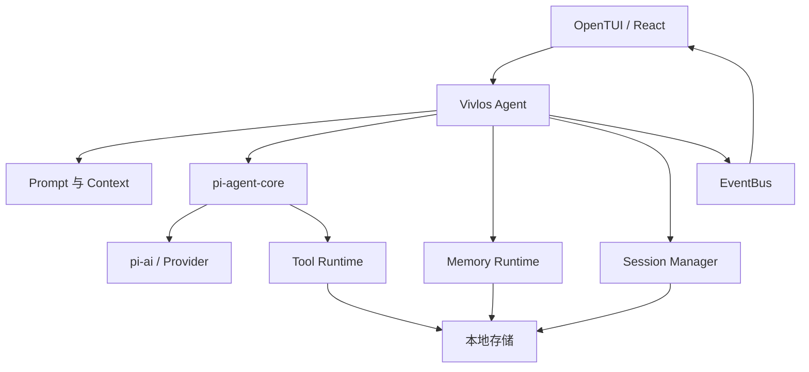
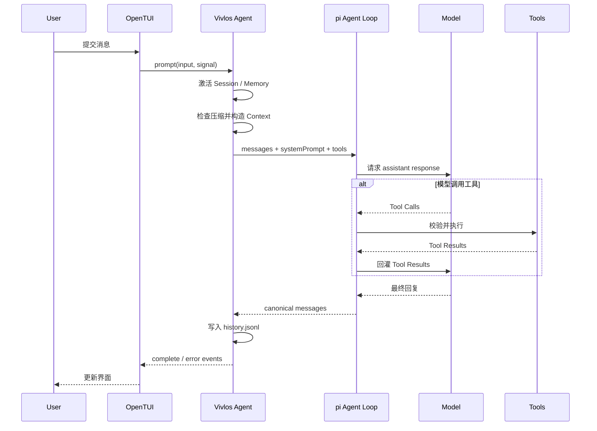

# 整体架构

Vivlos 是一个本地终端 Agent（智能体）。当前唯一可运行入口是 OpenTUI（终端界面），核心推理委托 pi-agent-core（智能体主循环库），模型目录与流式调用委托 pi-ai（模型接入库），Vivlos 负责上下文、工具、状态和界面编排。

## 设计目标

- 将模型、工具和本地状态组织成可观察的 Agent Loop（智能体主循环）。
- 让 Session（会话）、Memory（记忆）、Todo（待办）和配置具有明确的持久化边界。
- 通过 EventBus（事件总线）解耦运行时与终端界面。
- 对错误、中止、重试和上下文上限给出确定语义。
- 保留 Tool（工具）、Skill（技能）和其他入口的扩展空间。

## 架构分层

### Entry 层

`vivlos/entries/opentui/` 是应用入口和组合根，负责创建 EventBus、LLM、SessionManager、MemoryRuntime、PromptBuilder、Tools 和 React UI。

其他消息入口目前只有接口或占位目录，不属于可用能力。

### Agent 层

`vivlos/agent/` 负责：

- Agent Loop 编排、重试和终止控制。
- System Prompt 与运行时上下文构建。
- Session 生命周期和标题生成。
- 上下文剪枝、摘要与压缩。
- Memory、Todo、Task、Offer Choice 等高级能力。
- Builtin Tools 与 Skill 注册。

### Infra 层

`vivlos/infra/` 提供模型、配置、存储、事件和路径能力：

- pi-ai Provider 与 Model 管理。
- SQLite、JSONL 和 Markdown Repository。
- Workspace 路径解析。
- EventBus 与结构化事件。
- 运行参数加载。

### Shared 层

`vivlos/shared/` 保存 Result、错误类型和不依赖具体业务的通用能力。

## 一次请求的流程

当前 Todo 会作为本次请求的临时上下文参与推理，但不会写入 History（对话历史）。Memory 变化会让 Prompt（提示词）缓存失效，使同一 User Turn（对话轮次）的后续推理步骤读取新内容。

## 事件与状态

EventBus 是单进程内的事件分发器，连接 Agent、Memory、Session、Todo、Offer Choice 和 TUI。

主要事件包括：

- Agent 开始、消息增量、Thinking、Tool Call、完成和错误。
- Session 激活、切换、重命名和状态请求。
- Memory 操作、内容变化和 Consolidator 状态。
- Todo 更新与 Offer Choice 等待/完成。

EventBus 不是持久化来源。可恢复状态由 JSONL、Markdown、JSON 和 SQLite 保存。

## 数据边界

| 数据 | 存储 |
| --- | --- |
| 对话与 Tool Result（工具结果） | Session `history.jsonl` |
| L1 Memory | Session `memory.md`、`user.md` |
| L2 历史会话索引 | `.vivlos/memory.db`（可删除重建） |
| Todo | Session `todos.json` |
| 跨 Session Task（长期任务） | `.vivlos/tasks/` |
| Provider、Model、Credential（凭证） | `.vivlos/vivlos.db` |
| 运行参数 | `.vivlos/config.json` |

所有路径默认以启动命令的当前目录为根，而不是用户 Home。

## 当前边界

**已实现**：OpenTUI、主 Agent Loop、工具执行、Session、上下文压缩、L1 Memory、L2 历史会话检索（session_search）、图片识别（多模态附件与视觉模型指定）、Todo、Offer Choice（交互式选项）、Provider/Model 管理和本地存储。

**部分实现**：Task 已有 Tool 和磁盘存储，但没有完整 Sidebar（侧栏）工作流。

**设计中或占位**：L3/L4 Memory、Sandbox（沙箱）、Delegation（子智能体委派）、Scheduler（定时任务）、QQ 与其他消息入口。
