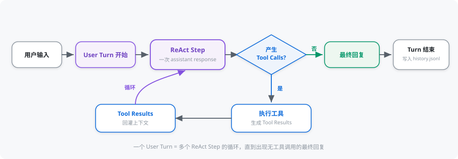
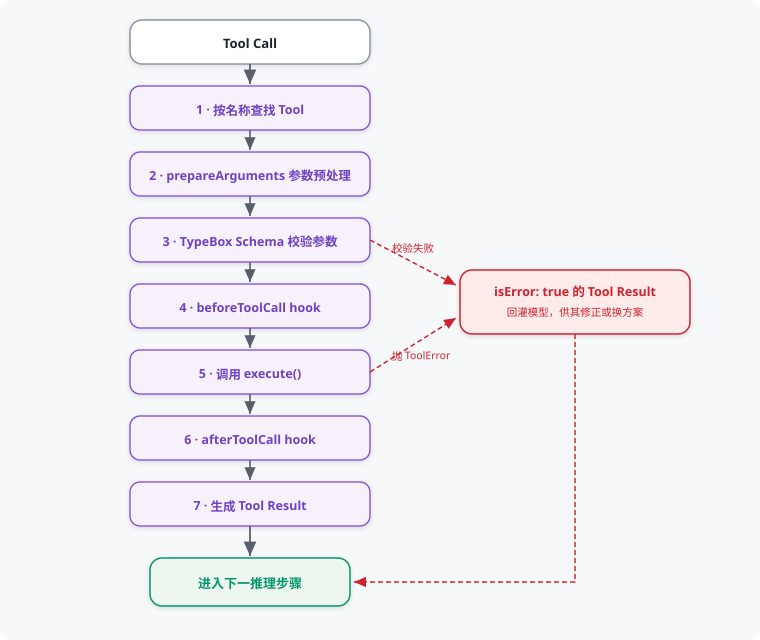
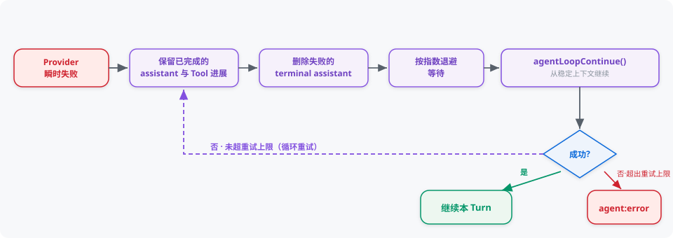

# 智能体运行机制

Vivlos 使用 pi-agent-core（智能体主循环库）执行标准 Tool Loop（工具循环），并在其外层补充 Prompt（提示词）、Session（会话）、Memory（记忆）、重试和顶层事件语义。

## System Prompt（系统提示词）

PromptBuilder（提示词构建器）按固定顺序组装：

1. `identity`：Agent 身份与职责。
2. `environment`：Runtime（运行时）、系统、工作目录、时间和语言。
3. `available_skills`：当前扫描到的 Skill（技能）元数据。
4. `memory`：当前 Session 的 L1 Memory。
5. `compacted_history`：上下文压缩摘要。
6. `rules`：工具调用、Memory、Todo 和 Skill 规则。

Prompt 使用 XML 标签划分不同来源。Memory 和历史摘要均被声明为不可信背景数据，不能作为可执行指令或操作完成证明。

## User Turn 与 ReAct Step

- **User Turn（对话轮次）**：从一次用户输入开始，到最终回复或错误结束。
- **ReAct step（推理步骤）**：一次 assistant response（模型回复），以及可能产生的 Tool Calls（工具调用）和 Tool Results（工具结果）。

一个 User Turn 可以包含多个 ReAct step。模型调用工具后，pi 会把 Tool Result 放入上下文并自动请求下一次模型回复。

## 多工具调用

多个工具互不依赖时，模型会在同一个回复中发出全部 Tool Calls；后续调用依赖前一个结果时才分轮。

pi 默认允许并行执行。若当前批次中任一 Tool 声明 `executionMode: "sequential"`（顺序执行），整批调用会顺序执行。Todo 和 Offer Choice 使用顺序执行，避免状态竞争和交互重叠。

## Tool 执行协议

每个 Tool Call 依次经过：

1. 根据名称查找 Tool。
2. 执行可选的 `prepareArguments`（参数预处理）。
3. 按 TypeBox Schema（参数结构定义）校验参数。
4. 执行 `beforeToolCall` hook（前置钩子）。
5. 调用 Tool `execute()`。
6. 执行 `afterToolCall` hook（后置钩子）。
7. 生成带 `isError` 标记的 Tool Result。

执行失败时抛出错误，pi 会将其转换成 `isError: true` 的 Tool Result 回灌模型，使模型有机会解释、修正参数或选择其他方案。

普通错误内容不能伪装成成功 Tool Result。只有真实成功结果才能用于声称操作完成。

## 参数修正

`prepareArguments` 只处理已知且边界明确的 Provider（模型服务商）兼容问题。例如 Todo 可以把合法的字符串化 Item 数组恢复成真实数组，但不会猜测修复损坏的 JSON。

参数准备或 Schema 校验失败不会直接中断整个 Agent。错误结果会进入下一个推理步骤，由模型重新发出合法调用。

## Retry（重试）

Provider 瞬时失败由 Vivlos 外层协调重试：

- 保留已完成的 assistant 和 Tool 进展。
- 删除失败的 terminal assistant message（终态失败回复）。
- 按指数退避等待。
- 使用 `agentLoopContinue()` 从稳定上下文继续。

上下文溢出不属于瞬时错误，不会通过网络重试解决。默认重试次数和退避参数来自 `.vivlos/config.json`。

## Abort（中止）

每次用户请求有独立的 `AbortSignal`（中止信号）。运行中按 `Ctrl+C` 会中止模型流或工具执行。

Abort 优先于正常完成、Tool `terminate`（终止标记）和最大轮次。只要请求信号已取消，顶层结果就发布 `agent:error(kind: "aborted")`，不会发送 `agent:complete`。

## 最大轮次

`maxTurns` 按整个 User Turn 累计成功的推理步骤计数，底层重试不会重置计数。

- 普通最终文本恰好位于上限时可以正常完成。
- 如果上限处存在尚需模型消费的 Tool Result，请求以明确错误结束。
- 如果整批 Tool Result 均设置 `terminate: true`，则无需继续请求模型，可以正常结束。
- 持续 steering（转向干预）或 follow-up（追问）也受同一上限限制。

## 完成与持久化

成功 User Turn 会一次性提交 canonical messages（正式消息）：

- user message（用户消息）
- assistant message（模型回复）
- toolResult message（工具结果）

临时 Todo Hint（待办提示）不写入 History（对话历史）。失败的模型回复也不会作为有效历史提交，但失败前已经完成的工具进展会在需要时保留。

顶层一次请求只发布一组 `agent:start` 与 `agent:complete` 或 `agent:error`，底层重试不会伪装成新的用户请求。
