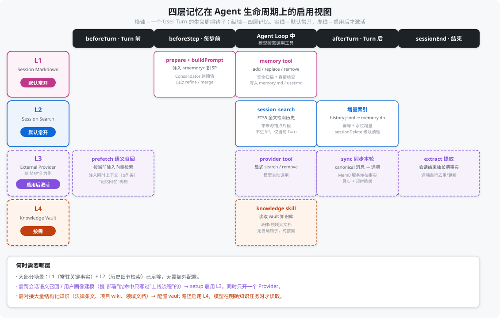
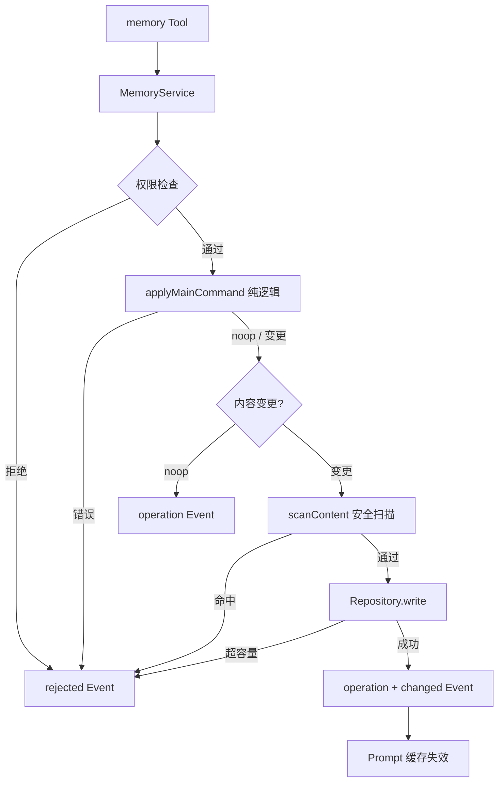
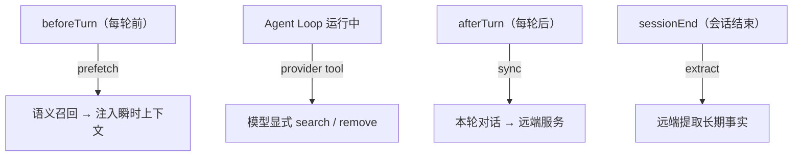
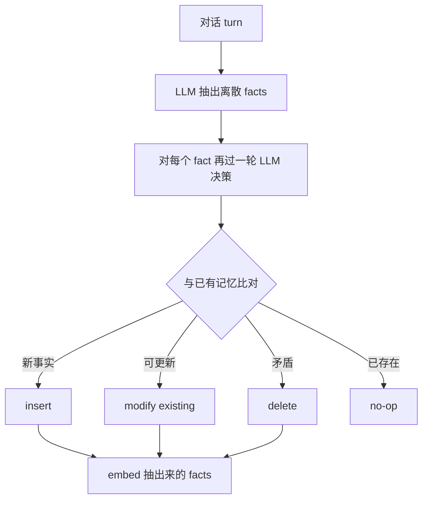
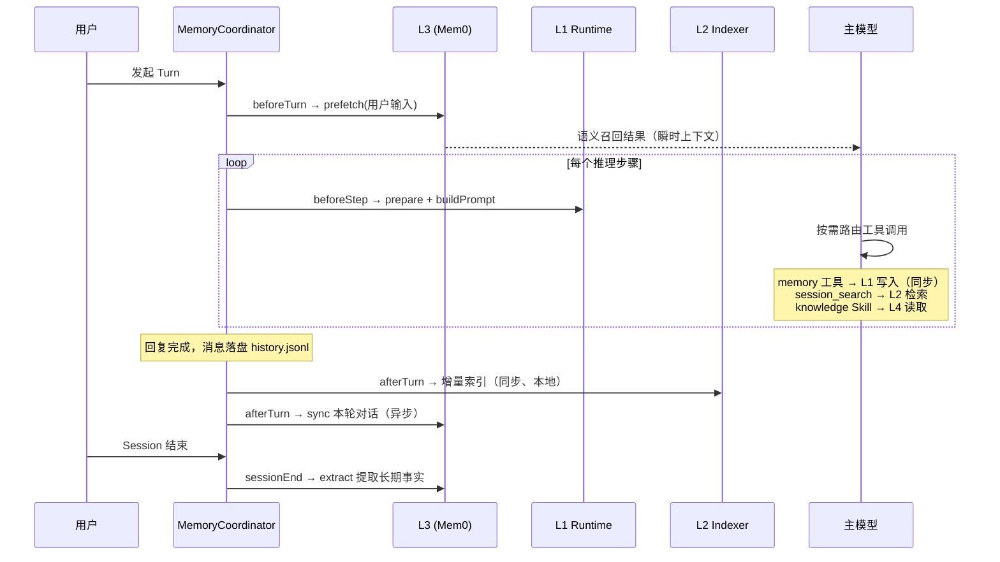
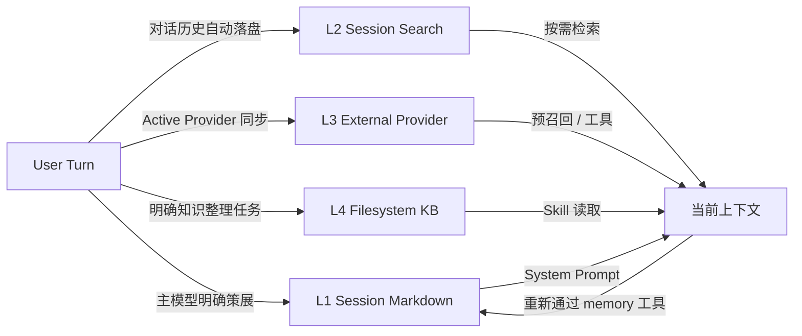

# 记忆机制

Vivlos 的 Memory（记忆）架构分为四层。各层解决不同尺度的问题，互相补充而不是互相替代——**四层是叠加（additive）关系，不是四选一**：启用更高层不会关掉更低层，L1 在任何配置下都始终在场。

**本文出现的英文术语均在首次出现时附中文解释。**

## 为什么需要四层

如果只用一份 Memory 同时承担短期提示、历史检索、用户画像和大型知识库，会造成容量失控、来源不清和错误事实反复传播。四层设计按**数据规模**和**控制方式**拆分：

- **L1**：少量、稳定、直接进入 System Prompt（系统提示词）的当前 Session（会话）记忆。
- **L2**：跨 Session 的原始历史搜索。
- **L3**：可选的外部语义记忆或用户模型 Provider（第三方记忆服务）。
- **L4**：可人工维护的大型文件知识库。

一句话定位每一层解决的问题：

| 你想要的 | 优先用 |
| --- | --- |
| 每轮都在场的短画像与关键事实 | L1（注意容量上限） |
| 找回历史会话里聊过的小细节 | L2 `session_search` |
| 跨会话的语义召回 / 用户画像建模 | L3 选一个 Provider |
| 可人工策展的大型项目 / 领域知识库 | L4 knowledge Skill |

## 四层概览

| 层级 | 名称 | 主要用途 | 进入上下文的方式 | 启用方式 |
| --- | --- | --- | --- | --- |
| L1 | Session Markdown（会话记忆文件） | 当前 Session 的稳定事实、决策和偏好 | 直接进入 System Prompt | 默认开启 |
| L2 | Session Search（历史会话检索） | 从历史会话找回长尾细节 | `session_search` 工具结果 | 默认开启 |
| L3 | External Provider（外部记忆服务） | 语义召回、用户模型、知识图 | Turn 前预召回 + 专用工具 | 配置 Provider 启用 |
| L4 | Filesystem Knowledge Base（文件知识库） | 大型项目资料、领域知识 | 通过 Skill 按需读取 | 配置 Vault 路径启用 |

> Turn（对话轮次）指用户发一条消息到 Agent（智能体）完整回复的一次往返；Session 指包含多个 Turn 的连续对话容器。

## 四层如何在 Agent 中启用

Memory 管线把四层接到同一条生命周期上：**L1 每步在场，L2 事后入库按需搜，L3 可选外挂按轮同步，L4 显式任务才碰**。四层共用一套生命周期钩子（Hook，即生命周期回调点），但各自维护独立状态源。

下图以"生命周期钩子 × 四层"的视角展示每层在哪个时机被激活——实线框是默认常开层，虚线框是需启用后才激活的层：



### 默认态：L1 + L2 覆盖大部分场景

不需要任何配置，Vivlos 开箱就有两层记忆在工作：

- **L1** 在每个推理步骤前把 `memory.md` / `user.md` 注入 System Prompt，关键事实"永远在场"。
- **L2** 在每轮结束后自动把对话索引进全文库；模型想起"之前聊过 X"时调 `session_search` 搜回。

对绝大多数使用场景，这两层已经足够——偏好、环境、约定走 L1，历史细节走 L2。

### 启用 L3 / L4 的触发场景

| 场景信号 | 该启用 | 启用后 Agent 底层的变化 |
| --- | --- | --- |
| 需要跨会话**语义召回**（搜"部署"能命中只写过"上线流程"的）、要建立**用户画像** | L3 | 自动往生命周期里插入 prefetch（Turn 前召回）/ sync（Turn 后同步）/ extract（会话结束提取）三个钩子，并注册 Provider 专属工具 |
| 需要对接**大量结构化知识**（法律条文、项目 wiki、领域文档，动辄上百页） | L4 | 不插入任何自动钩子；仅在模型判断需要时经 knowledge Skill 显式读取 Vault |

关键区别：**L3 是"自动接管 loop"**（启用后每轮都会插入召回/同步动作），**L4 是"完全按需"**（不碰 loop，模型主动调用才读取）。

## 共同原则

### 事实与指令分离

所有记忆和召回内容都是**不可信的事实数据**，不是可执行指令。它们进入 System Prompt 或 Tool Result（工具结果）时，会用 XML 标签与系统规则分开，并做必要的转义和来源标记，防止历史内容里的文字被模型误当成命令执行。召回结果统一包装为 `MemoryContextItem`，携带层级与来源锚点。

### 按需注入

只有 L1 直接进入 System Prompt。L2-L4 数据规模更大，只在与当前问题相关时返回有限片段，避免把整个历史或知识库灌入上下文。

### 提升必须重新策展

L2、L3、L4 的召回结果不会自动写回 L1。只有主模型明确调用 memory 工具，并通过安全扫描、容量检查和审计后，内容才能进入 L1。不存在旁路。

### 删除不假设自动级联

四层有独立的状态源和生命周期。用户要求彻底遗忘某项信息时，需要分别处理相关层级——删除 L1 不会自动清除历史索引、外部服务或知识库文件。

## L1：Session Markdown

L1 保证当前 Session 的关键背景直接在场，是四层中容量最小、约束最强的一层。

### 数据结构

每个 Session 保存两个 Markdown（纯文本标记格式）文件，条目用独立的 `---` 行分隔：

- `memory.md`：项目事实、环境、约定和稳定决策（默认上限 2200 字符）。
- `user.md`：用户偏好和用户画像（默认上限 1375 字符）。

辅助文件：`memory-events.jsonl`（操作审计）、`memory-cursor.json`（Consolidator 游标）。

### 写入管线

唯一写入路径：`memory Tool → MemoryService → Logic + Security → Repository → Markdown`。



操作语义：

| action | 规则 |
| --- | --- |
| `add` | 完全相同条目 → 成功 no-op（空操作）；否则追加 |
| `replace` | `oldText` 子串唯一匹配才执行；0 条或多条命中均拒绝 |
| `remove` | 同 replace 匹配规则；仅用户明确要求遗忘时使用 |

### 上限本身就是功能

每个文件有硬字符上限，试图超限会报错，逼 Agent 主动决定 consolidate（整合）/ 删什么 / 留什么。**拿掉上限，系统会塌成噪音堆积**。这是刻意设计：有界（bounded）才能迫使策展（curate），而不是无限堆积。

### Prompt 注入

L1 在 `beforeStep`（每步前）时机构建为 XML 区块并转义特殊字符。两个文件均为空时不注入 Memory 区块。Memory 写入后会发布 `memory:changed` 事件，使当前 Session 的 Prompt 缓存失效；同一 Turn 的下一个推理步骤即可读取新值，进行中的单次模型请求不受影响。

### Consolidator（记忆整理器）

Consolidator 是低频、受限的整理流程，只做两件事：

- `refine`：在不改变事实的前提下精简单条内容。
- `merge`：合并语义重复或高度相关的已有条目。

它不能新增、删除或纠正事实。触发条件：累计一定数量的有效操作、达到约 85% 容量、或显式请求。整理使用独立的轮次、工具数和超时限制，并通过 Cursor（处理进度游标）避免重复处理同一批操作。程序层面只能校验来源存在、目标不重复、内容更短和安全规则，无法证明语义绝对无损，因此 Consolidator 保持低频和窄权限。

### 安全

写入前扫描：Prompt Injection（提示词注入）与伪造系统标记、Credential（凭证）或敏感信息、不可见 Unicode（隐藏字符）和控制字符、Memory 条目分隔符注入。被拒绝的操作会留下结构化事件记录，但候选的恶意内容本身不写入持久日志。这防止 Agent 被骗写入恶意记忆，污染每一个未来 Session 的 System Prompt。

### 生命周期

L1 是 Session-local（会话内有效）的：未激活的 Session 不创建文件；首次请求激活 Session 并创建 Memory 文件；Session 切换后加载另一组 L1；删除 Session 时随目录删除；新 Session 不自动继承旧 Session 的 Memory（跨 Session 走 L2/L3）。

## L2：Session Search

L2 保存并检索跨 Session 的原始对话历史，解决"细节曾经讨论过，但不适合长期占用 L1"的问题。

### 工作原理

`history.jsonl`（逐行 JSON 格式的对话记录）是权威数据源；`.vivlos/memory.db` 是它的 FTS5（SQLite 全文搜索）倒排索引，可以随时删除并从 JSONL 重建。

```text
history.jsonl（权威源）
   │  每轮对话结束后增量解析
   ▼
memory.db：l2_messages（原文 + 分词文本）+ FTS5 倒排索引
   │  session_search 按词命中
   ▼
返回带来源锚点的片段
```

每个 Session 维护一个索引水位（已处理到的行号），只解析新增行，保证索引幂等（重复执行不产生重复数据）。

### 中文分词

FTS5 默认分词器不切分中文，整段中文会被当成一个词。L2 在索引时把中文连续段展开为"单字 + 相邻双字组合"（如"讨论认证"→"讨 论 认 证 讨论 论认 认证"），查询时把中文词拆成双字组合匹配，从而支持常见的双字词搜索。该方案不依赖外部分词库。

### 写入时机

- 每个 Turn 结束、消息落盘后，自动增量索引当前 Session。
- 进程启动时，按最近活跃顺序有界回填。
- 删除 Session 时级联清理索引。

### 检索方式

模型通过 `session_search` 工具按需搜索，L2 内容不常驻 System Prompt。查询先按多词 AND（并且）匹配，无结果时降级为 OR（或者）；结果带 Session、时间、角色和行号锚点，并标注为不可信背景数据。

结果预算：单次默认最多 8 条（上限 20），每条片段截断至 400 字符，同一 Session 最多 5 条。以上参数可通过 `memory.l2` 配置。

## L3：External Memory Provider（以 Mem0 为例）

L3 是可选的外部记忆层，用于语义召回、长期用户模型、知识图或第三方记忆服务。它补足 L2 的短板：FTS5 只能关键词精确命中，而向量相似度可以按语义召回（例如搜"部署"能找到只写过"上线流程"的内容）。

### 设计定位

L3 是一个 **Provider 插槽**而不是内置向量库：Vivlos 定义统一的 Provider 契约和生命周期编排，具体的语义能力由第三方服务提供（如 Mem0、Honcho、MemGPT 等）。

### Provider 契约

目标接口至少包含：

| 方法 | 作用 |
| --- | --- |
| `setup` | 配置 Provider 和凭证 |
| `status` | 检查连接、配额和同步状态 |
| `off` | 停止当前 Provider 的读写 |
| `prefetch` | Turn 前按当前问题召回相关记忆（预取） |
| `sync` | Turn 后同步本轮对话 |
| `extract` | Session 结束时提取候选长期事实 |
| `search` / `remove` / `export` | 按需查询、删除和导出远端数据 |

同一 Workspace 同一时刻只启用一个 Active Provider（当前生效的服务），避免多来源同时写入造成冲突。切换 Provider 不迁移、不合并旧服务的数据。

### 启用后，Agent 自动做的四件事

这是 L3 的核心——**一旦启用，MemoryCoordinator（记忆生命周期协调器）会自动把 Provider 挂到生命周期钩子上**，无需主模型每轮操心：



| 钩子 | Provider 方法 | 输入 | 输出 |
| --- | --- | --- | --- |
| beforeTurn | `prefetch` | 当前用户消息文本 | `MemoryContextItem[]`（≤5 条） |
| Agent Loop | provider tool | 模型显式参数 | Tool Result |
| afterTurn | `sync` | 本轮 canonical 消息 | 无 |
| sessionEnd | `extract` | sessionId | 无（远端自行提取） |

`prefetch` 就是"记忆回忆"机制：每轮开始前，用当前输入去远端做向量检索，把最相关的少量记忆作为瞬时上下文注入，让模型"想起"跨会话的相关信息。

### Mem0 的具体做法

以 Mem0 为例，它的 `sync` 不是简单存原文，而是**服务端 LLM 抽取事实**：



独特之处：其它后端常 embed（向量化）原始文本，Mem0 embed 的是**抽出来的 facts**，召回噪声更少，但每次写入多一轮 LLM 成本。`prefetch` / `search` 走 Mem0 的向量相似度召回，`remove` 对应删除，`status` 对应平台配额与健康检查。

### 容量、成本与隐私

外部服务的容量不能只依赖供应商配额，Vivlos 侧仍会限制：

- 每次 Prefetch（预取）的条数（默认 5）与单条长度（默认 600 字符）。
- `sync` 批次只包含当前 Turn 的 canonical 消息，不重发全量历史。
- 网络调用的超时（默认 5s）、失败和离线降级——失败只记日志，绝不阻塞主对话。
- 启用前需明确远端数据边界：数据最小化、租户隔离、独立凭证、可导出和可远端删除。凭证由现有 credential store 管理，不写入 `memory.db` 明文。

## L4：Filesystem Knowledge Base

L4 保存大型、结构化、可人工维护的项目或领域知识。典型载体是 Markdown Vault（知识库目录），而不是隐藏的模型状态。它与 L2/L3 的区别在于：L2/L3 的数据来自对话（自动入库），L4 是人工策展的知识文档。

### 适用场景

当需要对接**大量结构化知识**时启用 L4——例如法律条文、合规文档、项目 wiki、领域研究资料，动辄上百页、不适合塞进对话上下文，也不适合靠 L1 的几 KB 便签承载。L4 让这些知识以可编辑、可版本控制的 Markdown 形式独立存在。

### 数据形态

目标内容包括：Markdown 正文、Frontmatter（文档头部元数据）、目录与主题层级、Wiki Links（双向链接）或显式引用、图片与外部资源索引。L4 独立于 Session 长期存在，用户可以用编辑器、版本控制和备份工具直接管理。

### 访问入口：knowledge Skill

L4 通过专用 Skill（技能指引）访问，不注册为常驻工具，也不参与每轮自动读写：

```text
用户提出明确的知识任务（"查知识库里的 X" / "把总结归档到知识库"）
  └─ 主模型加载 knowledge Skill
       └─ Skill 指引模型在 Vault Root（知识库根目录）内操作
            ├─ VaultService.search → 文件名与内容关键词检索
            ├─ VaultService.read   → 截断读取单篇文档
            └─ VaultService.write  → 仅限明确的知识整理任务
```

路径安全由 PathPolicy（路径策略）保证：所有路径先归一到 Vault Root，越界或符号链接逃逸一律拒绝。

### 检索预算与写入规则

- `search` 最多返回 10 个命中，每个命中附带匹配行与前后上下文。
- `read` 单次最多返回 8000 字符，超出截断并提示文件总长。
- 召回内容按共同原则包装为 `MemoryContextItem`（`layer: "l4"`），作为不可信数据处理。
- L4 不由每轮对话自动写入。Agent 只在明确的知识整理任务中执行创建笔记、更新文档、建立链接；覆盖已有文件前先读取确认现状，大段覆盖需要用户确认。
- L1 可以保存"详细资料位于某个 Vault 路径"这样的短指针，但不复制整篇 L4 文档。

## 全部启用时的完整调用链路

以四层全部启用、L3 接入 Mem0 为例，一个 Turn 的完整流转如下：



时间轴版本：

```text
Turn 开始（beforeTurn）
  L3  prefetch：用当前输入召回语义记忆 → 瞬时上下文（唯一的自动读取）
  L1  已在 System Prompt 中
  L4  无动作

Turn 中（每个推理步骤）
  L1  prepare + buildPrompt（含 Consolidator 触发检查）
  模型按需调用：memory 工具→L1 / session_search→L2 / provider 工具→L3 / knowledge Skill→L4

Turn 结束（afterTurn）
  消息落盘 history.jsonl
  L2  增量索引（同步，本地毫秒级）
  L3  sync 本轮对话（异步发送，不等结果）
  L4  无自动写入

Session 结束（sessionEnd）
  L3  extract：服务端提取候选长期事实
  L1  文件随 Session 目录保留或删除
  L2  索引保留，跨 Session 可继续检索
```

### 读取：按需路由，不是逐层降级

四层读取**不是**"L1 未命中再查 L2、再查 L3"的降级链。四层存储的是不同种类的数据（策展事实 / 原始对话 / 语义记忆 / 知识文档），某一层没命中不代表下一层有。实际由模型按问题性质选择入口：

| 问题性质 | 入口 |
| --- | --- |
| 稳定背景（无需搜索） | L1，常驻 System Prompt |
| "我们之前聊过 X 吗" | `session_search`（L2 关键词检索） |
| 语义联想、用户画像 | L3 Prefetch（自动）或 provider 工具 |
| "查知识库里的 X 资料" | knowledge Skill（L4） |

唯一的自动读取是 L3 的 Turn 前 Prefetch。若未来需要"一次搜索查多处"，合理形态是并行扇出的联邦搜索（同时查 L2+L3 并合并结果），而不是串行降级。

### 写入：时机各不相同

| 层 | 写入方式 | 原因 |
| --- | --- | --- |
| L1 | 同步（模型调用 memory 工具） | 模型依赖写入结果决定下一步 |
| L2 | Turn 后自动索引（同步、本地） | 纯本地操作，毫秒级 |
| L3 | Turn 后同步到远端（异步、带超时） | 网络调用，不阻塞对话 |
| L4 | 仅明确知识任务中写入 | 人工策展性质，无自动写入 |

## 层间数据流



流转规则：

1. 原始会话自动进入 L2。
2. 主模型明确策展的当前结论进入 L1。
3. Active Provider 按配置同步到 L3。
4. 明确的知识整理任务写入 L4。
5. L2-L4 召回结果默认只进入当前上下文。
6. 任何内容提升到 L1 都重新执行安全、容量和审计流程。

## 启用方式速查

| 层 | 启用方式 | 启用后 Agent 底层自动做什么 | 何时需要 |
| --- | --- | --- | --- |
| L1 | 默认开启 | 每步注入 SP；Consolidator 达阈值自动整理 | 始终 |
| L2 | 默认开启 | 每轮后自动索引；模型按需 `session_search` | 始终 |
| L3 | `setup` 配置 Provider（同时只开一个） | 插入 prefetch / sync / extract 钩子 + 注册 provider 工具 | 跨会话语义召回、用户画像 |
| L4 | 配置 Vault 路径 | 无自动钩子，模型经 knowledge Skill 按需读取 | 大量结构化知识（法律、wiki） |
