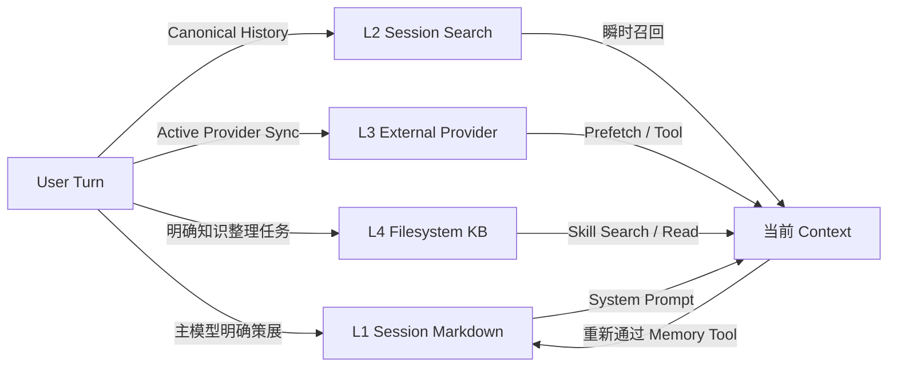

# 记忆机制

Vivlos 的目标 Memory 架构分为四层。各层解决不同尺度的问题，不互相替代，也不应自动互相污染。

> [!IMPORTANT]
> 当前源码只完整实现了 L1 Session Memory。L2、L3、L4 是目标设计，TUI 中仅保留导航占位，不能视为当前可用功能。

## 为什么需要四层

单一 Memory 同时承担短期提示、历史检索、用户画像和大型知识库，会造成容量失控、来源不清和错误事实反复传播。四层设计按数据规模和控制方式拆分：

- **L1**：少量、稳定、直接进入 Prompt 的当前 Session 记忆。
- **L2**：跨 Session 的原始历史搜索。
- **L3**：可选的外部语义记忆或用户模型 Provider。
- **L4**：可人工维护的大型文件知识库。

## 四层概览

| 层级 | 名称 | 主要用途 | 注入方式 | 当前状态 |
| --- | --- | --- | --- | --- |
| L1 | Session Markdown | 当前 Session 的稳定事实、决策和偏好 | 直接进入 System Prompt | 已实现 |
| L2 | Session Search | 从历史会话找回长尾细节 | `session_search` Tool Result | 设计中 |
| L3 | External Provider | 语义召回、用户模型、知识图或远端 Memory | Turn 前 Prefetch 或 Provider Tool | 设计中 |
| L4 | Filesystem Knowledge Base | 大型项目资料、研究笔记和领域知识 | Skill 按需 search/read | 设计中 |

## 共同原则

### 事实与指令分离

所有 Memory 和召回内容都是不可信事实数据，不是可执行指令。进入 Prompt 或 Tool Result 时必须与系统规则分离，并进行必要的转义和来源标记。

### 按需注入

只有 L1 直接进入 System Prompt。L2-L4 数据规模更大，默认只返回与当前问题相关的有限片段，避免把整个历史或知识库灌入上下文。

### 提升必须重新策展

L2、L3、L4 的召回结果不能自动写回 L1。只有主模型明确发出新的 Memory 命令，并通过安全扫描、容量检查和审计后，内容才能进入 L1。

### 删除不假设自动级联

四层有独立的状态源和生命周期。用户要求彻底遗忘某项信息时，上层编排需要分别处理相关层级，不能假定删除 L1 就会清除历史、外部 Provider 或知识库文件。

## L1：Session Markdown

L1 保证当前 Session 的关键背景直接在场，是四层中容量最小、约束最强的一层。

### 数据结构

每个 Session 保存两个文件：

- `memory.md`：项目事实、环境、约定和稳定决策。
- `user.md`：用户偏好和用户画像。

条目使用独立的 `---` 行分隔。Repository 同时维护条目列表、字符使用量和由文件内容计算的 Revision。

```text
.vivlos/sessions/<session-id>/
├── memory.md
├── user.md
├── memory-events.jsonl
└── memory-cursor.json
```

### 写入来源

主模型通过 `memory` Tool 在线策展：

- `add`：新增稳定条目。
- `replace`：更新当前 Memory 中唯一匹配的原文。
- `remove`：仅在用户明确要求遗忘时删除唯一匹配内容。

适合写入的内容包括明确要求记住的约定、用户纠正、稳定项目决策和长期有效偏好。临时对话、原始搜索结果和可随时重新获取的信息不应进入 L1。

### 更新规则

- 完全相同的 `add` 是成功 No-op，不重复写入。
- `replace` 和 `remove` 使用子串定位，匹配不唯一时拒绝操作。
- 写入必须经过 MemoryService，Tool 不直接操作 Markdown。
- 操作失败必须返回真实 Tool Error，不能声称已经保存。

### Prompt 注入

L1 在模型推理前构建为 XML 区块并转义特殊字符。两个文件均为空时不注入 Memory 区块。

Memory 写入后会发布 `memory:changed`，使当前 Session 的 Prompt 缓存失效。同一次 User Turn 中，下一次 ReAct step 可以读取新值；正在进行的单次模型请求不会被中途修改。

### 容量

默认字符上限：

- `memory.md`：2200 字符。
- `user.md`：1375 字符。

超过上限时拒绝写入，不静默截断。达到约 85% 容量或积累一定数量的 committed 操作时，可以触发 Consolidator。

### Consolidator

Consolidator 是低频、受限的整理 Agent，只能：

- `refine`：在不改变事实的前提下精简单条内容。
- `merge`：合并语义重复或高度相关的已有条目。

它不能新增、删除或纠正事实。整理使用独立轮次、Tool 数和超时限制，并通过 Cursor 避免重复处理同一批主操作。

当前代码主要验证来源存在、目标不重复、内容更短和安全规则，无法从程序上证明语义绝对无损，因此 Consolidator 仍必须保持低频和窄权限。

### 安全

写入前扫描：

- Prompt Injection 和伪造系统标记。
- Credential 或敏感信息。
- 不可见 Unicode 和控制字符。
- Memory 条目分隔符注入。

拒绝操作会留下结构化 Operation Event，但候选恶意内容不应写入持久日志。

### 生命周期

L1 是 Session-local：

- Pending Session 不创建文件。
- 首次请求激活 Session 并创建 Memory 文件。
- Session 切换后加载另一组 L1。
- 删除 Session 时随 Session 目录删除。
- 新 Session 不自动继承旧 Session 的 Memory。

## L2：Session Search

L2 保存并检索跨 Session 的原始对话历史，解决“细节曾经讨论过，但不适合长期占用 L1”的问题。

### 目标数据

L2 以 Session Message 为最小检索单元，至少保存：

- Session ID 和 Message ID。
- Role 与文本内容。
- 时间、Workspace 和来源通道。
- 可选标题、摘要和删除状态。

目标实现可以使用 SQLite FTS5 建立全文索引。JSONL 仍是原始会话状态源，索引可以从 JSONL 重建。

### 写入与同步

- canonical Message 写入 `history.jsonl` 后幂等更新索引。
- Session 删除时同步删除或标记对应索引。
- 启动时可以增量检查缺失记录。
- 索引损坏时允许从现有 Session 回放重建。

### 检索

Agent 通过 `session_search` 按需搜索，而不是把 L2 常驻 System Prompt。结果应包含：

- 有限数量的相关片段。
- Session、时间和 Message 来源。
- 相关度或匹配依据。
- 必要时生成的局部摘要。

检索结果只在当前 User Turn 中作为 Tool Result 使用。模型若认为某项结论需要稳定保存，必须重新调用 L1 Memory Tool。

### 生命周期与容量

L2 跨 Session 保存，容量远大于 L1，但不是无限存储。目标实现需要配置：

- History retention。
- 单次返回数量和片段长度。
- 索引清理、Prune 和 Vacuum。
- Workspace 与用户隔离。

### 安全

历史文本可能包含旧 Tool Result、错误指令或敏感数据。L2 搜索必须按 Workspace 和 Session 授权，结果继续作为不可信数据处理，并确保删除请求传播到索引。

## L3：External Memory Provider

L3 是可选外部层，用于语义召回、长期用户模型、知识图、多租户 Memory 或第三方 Memory 服务。

### Provider 抽象

目标接口应至少提供：

- `setup`：配置 Provider 和凭证。
- `status`：检查连接、配额和同步状态。
- `off`：停止当前 Provider 的读写。
- `sync`：同步当前 User Turn。
- `prefetch`：在推理前召回相关 Memory。
- `extract`：在 Session 结束时提取候选长期事实。
- `search/remove/export`：按需查询、删除和导出远端数据。

同一 Workspace 同一时刻只启用一个 Active Provider，避免多来源同时写入造成冲突。

### 数据映射

本地需要维护远端 ID 映射，例如：

- Workspace ID
- User ID
- Agent ID
- Session ID
- Message ID
- Memory ID

Provider 凭证和映射配置保存在本地，远端数据由对应服务管理。切换 Provider 不应默认迁移或合并历史数据。

### 写入与召回

- 每个 User Turn 后可同步对话。
- Session 结束时可由 Provider 提取候选事实。
- 每个 User Turn 前根据当前查询 Prefetch 少量相关内容。
- 复杂检索可以通过 Provider Tool 显式执行。

Prefetch 和搜索结果是瞬时上下文，不能直接覆盖 L1。

### 容量、成本与隐私

外部 Provider 的容量不能只依赖供应商配额。Vivlos 仍需限制：

- 每次 Prefetch 条数和 Token。
- 写入频率与批次大小。
- 推理、索引和网络成本。
- 超时、失败和离线降级。

启用前必须明确远端数据边界。目标设计应支持数据最小化、租户隔离、独立 Credential、导出和远端删除。

## L4：Filesystem Knowledge Base

L4 保存大型、结构化、可人工维护的项目或领域知识。典型载体是 Markdown Vault，而不是隐藏的模型状态。

### 数据形态

目标内容可以包括：

- Markdown 正文。
- Frontmatter 元数据。
- 目录与主题层级。
- Wiki Links 或显式引用。
- 图片、附件和外部资源索引。
- 可重建的全文或向量索引。

L4 独立于 Session 长期存在，可以由用户使用编辑器、版本控制和备份工具直接管理。

### 写入方式

L4 不应由每轮对话自动写入。Agent 只能在明确的知识整理任务中，通过专用 Skill 执行：

- 创建笔记。
- 读取和搜索已有知识。
- 更新指定文档。
- 建立链接和目录。
- 整理研究材料。

大型批量覆盖需要用户确认，避免模型错误破坏人工知识库。

### 检索与注入

Agent 通过 Skill 按需 search/read，只把相关片段放入当前上下文。L1 可以保存“详细资料位于某个 Vault 路径”这样的短指针，但不复制整篇 L4 文档。

### 生命周期与安全

L4 生命周期由 Vault 所有者决定，可以独立备份和版本控制。实现必须：

- 限定 Vault Root。
- 防止路径穿越和 Symlink 越界。
- 扫描敏感信息和不可信指令。
- 限制单文档、单结果和总 Token。
- 对写入、移动和删除提供明确确认边界。

## 层间数据流



推荐流转规则：

1. 原始会话自动进入 L2。
2. 主模型明确策展的当前结论进入 L1。
3. Active Provider 按配置同步到 L3。
4. 明确的知识整理任务写入 L4。
5. L2-L4 召回结果默认只进入当前 Context。
6. 任何内容提升到 L1 都重新执行安全、容量和审计流程。

## 实现状态

| 能力 | 状态 |
| --- | --- |
| L1 Repository、Service、Tool、Prompt 注入 | 已实现 |
| L1 安全扫描、容量和 Operation Event | 已实现 |
| L1 Consolidator refine/merge | 已实现 |
| L1 TUI 查看 | 已实现 |
| L2 索引、搜索、Retention | 未实现 |
| L3 Provider Adapter 与远端同步 | 未实现 |
| L4 Vault Skill 与知识库边界 | 未实现 |

后续实现 L2-L4 时，应保持现有层级边界，不将搜索结果自动回写 L1，也不把外部知识误标为已经验证的用户事实。
