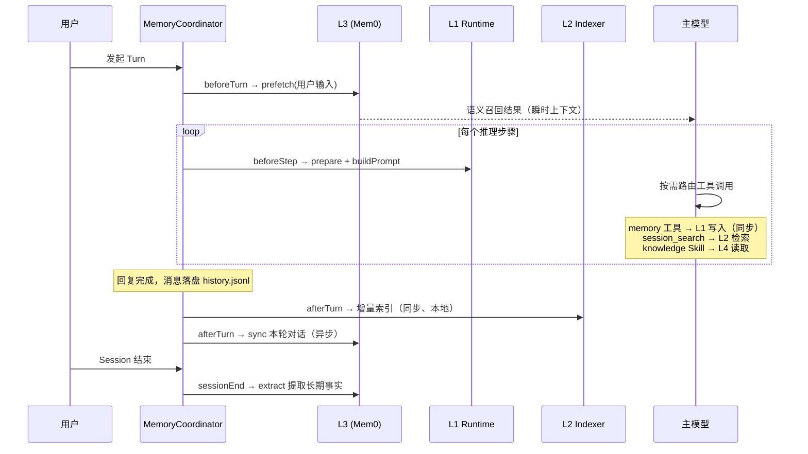
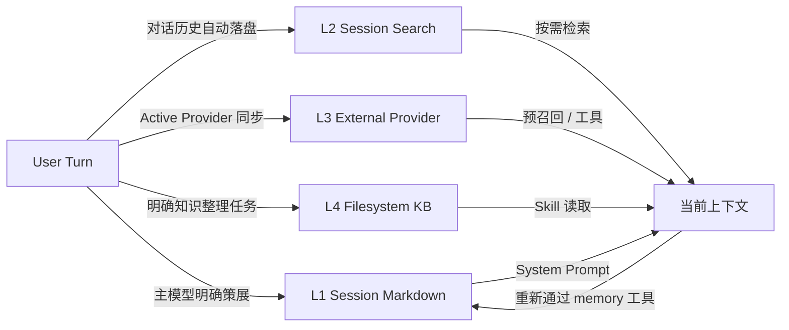

# 记忆机制

Vivlos 的 Memory（记忆）架构分为四层。各层解决不同尺度的问题，互相补充而不是互相替代。

> [!IMPORTANT]
> 当前源码已实现 L1 Session Memory（会话记忆）与 L2 Session Search（历史会话检索）。L3、L4 已有完整设计，尚未实现，TUI（终端界面）中仅保留导航占位。

**本文出现的英文术语均在首次出现时附中文解释。**

## 为什么需要四层

如果只用一份 Memory 同时承担短期提示、历史检索、用户画像和大型知识库，会造成容量失控、来源不清和错误事实反复传播。四层设计按数据规模和控制方式拆分：

- **L1**：少量、稳定、直接进入 System Prompt（系统提示词）的当前 Session（会话）记忆。
- **L2**：跨 Session 的原始历史搜索。
- **L3**：可选的外部语义记忆或用户模型 Provider（第三方记忆服务）。
- **L4**：可人工维护的大型文件知识库。

## 四层概览

| 层级 | 名称 | 主要用途 | 进入上下文的方式 | 当前状态 |
| --- | --- | --- | --- | --- |
| L1 | Session Markdown（会话记忆文件） | 当前 Session 的稳定事实、决策和偏好 | 直接进入 System Prompt | 已实现 |
| L2 | Session Search（历史会话检索） | 从历史会话找回长尾细节 | `session_search` 工具结果 | 已实现 |
| L3 | External Provider（外部记忆服务） | 语义召回、用户模型、知识图或远端记忆 | Turn 前预召回或专用工具 | 设计中 |
| L4 | Filesystem Knowledge Base（文件知识库） | 大型项目资料、研究笔记和领域知识 | 通过 Skill 按需读取 | 设计中 |

> Turn（对话轮次）指用户发一条消息到 Agent（智能体）完整回复的一次往返；Session 指包含多个 Turn 的连续对话容器。

## 共同原则

### 事实与指令分离

所有记忆和召回内容都是**不可信的事实数据**，不是可执行指令。它们进入 System Prompt 或 Tool Result（工具结果）时，会用 XML 标签与系统规则分开，并做必要的转义和来源标记，防止历史内容里的文字被模型误当成命令执行。

### 按需注入

只有 L1 直接进入 System Prompt。L2-L4 数据规模更大，只在与当前问题相关时返回有限片段，避免把整个历史或知识库灌入上下文。

### 提升必须重新策展

L2、L3、L4 的召回结果不会自动写回 L1。只有主模型明确调用 memory 工具，并通过安全扫描、容量检查和审计后，内容才能进入 L1。

### 删除不假设自动级联

四层有独立的状态源和生命周期。用户要求彻底遗忘某项信息时，需要分别处理相关层级——删除 L1 不会自动清除历史索引、外部服务或知识库文件。

## L1：Session Markdown（已实现）

L1 保证当前 Session 的关键背景直接在场，是四层中容量最小、约束最强的一层。

### 数据结构

每个 Session 保存两个 Markdown（纯文本标记格式）文件：

- `memory.md`：项目事实、环境、约定和稳定决策。
- `user.md`：用户偏好和用户画像。

条目使用独立的 `---` 行分隔。存储层同时维护条目列表、字符使用量和由文件内容计算的 Revision（内容版本号）。

```text
.vivlos/sessions/<session-id>/
├── memory.md
├── user.md
├── memory-events.jsonl
└── memory-cursor.json
```

### 写入来源

主模型通过 memory 工具在线策展（主动筛选记录）：

- `add`：新增稳定条目。
- `replace`：更新当前 Memory 中唯一匹配的原文。
- `remove`：仅在用户明确要求遗忘时删除唯一匹配内容。

L1 的定位是高价值稳定记忆：用户明确要求记住的约定、用户纠正、稳定项目决策和长期有效偏好会被保留；临时对话、原始搜索结果和可随时重新获取的信息不纳入。

### 更新规则

- 完全相同的 `add` 是成功 No-op（空操作），不重复写入。
- `replace` 和 `remove` 使用子串定位，匹配不唯一时拒绝操作。
- 写入统一经过 MemoryService（记忆写入服务），工具不直接操作文件。
- 操作失败时返回真实的工具错误，模型不会误以为已保存。

### Prompt 注入

L1 在模型推理前构建为 XML 区块并转义特殊字符。两个文件均为空时不注入 Memory 区块。

Memory 写入后会发布 `memory:changed` 事件，使当前 Session 的 Prompt 缓存失效。同一次 Turn 中，下一个推理步骤即可读取新值；正在进行的单次模型请求不会被中途修改。

### 容量

默认字符上限：

- `memory.md`：2200 字符。
- `user.md`：1375 字符。

超过上限时拒绝写入，不静默截断。达到约 85% 容量或积累一定数量的有效操作时，会触发 Consolidator（记忆整理器）。

### Consolidator（记忆整理器）

Consolidator 是低频、受限的整理流程，只做两件事：

- `refine`：在不改变事实的前提下精简单条内容。
- `merge`：合并语义重复或高度相关的已有条目。

它不能新增、删除或纠正事实。整理使用独立的轮次、工具数和超时限制，并通过 Cursor（处理进度游标）避免重复处理同一批操作。

程序层面只能校验来源存在、目标不重复、内容更短和安全规则，无法证明语义绝对无损，因此 Consolidator 保持低频和窄权限。

### 安全

写入前扫描：

- Prompt Injection（提示词注入）和伪造系统标记。
- Credential（凭证）或敏感信息。
- 不可见 Unicode（隐藏字符）和控制字符。
- Memory 条目分隔符注入。

被拒绝的操作会留下结构化事件记录，但候选的恶意内容本身不写入持久日志。

### 生命周期

L1 是 Session-local（会话内有效）的：

- 未激活的 Session 不创建文件。
- 首次请求激活 Session 并创建 Memory 文件。
- Session 切换后加载另一组 L1。
- 删除 Session 时随 Session 目录删除。
- 新 Session 不自动继承旧 Session 的 Memory。

## L2：Session Search（已实现）

L2 保存并检索跨 Session 的原始对话历史，解决"细节曾经讨论过，但不适合长期占用 L1"的问题。

### 工作原理

`history.jsonl`（逐行 JSON 格式的对话记录）是权威数据源；`.vivlos/memory.db` 是它的 FTS5（SQLite 全文搜索）倒排索引，可以随时删除并从 JSONL 重建。

```text
history.jsonl（权威源）
   │  每轮对话结束后增量解析
   ▼
memory.db：l2_messages（原文 + 分词文本）+ FTS5 倒排索引
   │  session_search 按词命中
   ▼
返回带来源锚点的片段
```

每个 Session 维护一个索引水位（已处理到的行号），只解析新增行，保证索引幂等（重复执行不产生重复数据）。

### 中文分词

FTS5 默认分词器不切分中文，整段中文会被当成一个词。L2 在索引时把中文连续段展开为"单字 + 相邻双字组合"（如"讨论认证"→"讨 论 认 证 讨论 论认 认证"），查询时把中文词拆成双字组合匹配，从而支持常见的双字词搜索。

### 写入时机

- 每个 Turn 结束、消息落盘后，自动增量索引当前 Session。
- 进程启动时，按最近活跃顺序有界回填（默认最多 50 个 Session）。
- 删除 Session 时级联清理索引。

### 检索方式

模型通过 `session_search` 工具按需搜索，L2 内容不常驻 System Prompt。查询先按多词 AND（并且）匹配，无结果时降级为 OR（或者）；结果带 Session、时间、角色和行号锚点，并标注为不可信背景数据。

结果预算：单次默认最多 8 条（上限 20），每条片段截断至 400 字符，同一 Session 最多 5 条。以上参数可通过 `memory.l2` 配置。

### 后续目标

History retention（历史保留期）、索引 Prune（清理）与 Vacuum（压缩）、跨用户隔离仍属于后续目标。

### 安全

历史文本可能包含旧工具结果、错误指令或敏感数据。L2 索引按 Workspace（工作目录）隔离，搜索结果作为不可信数据处理，删除 Session 会同步传播到索引。

## L3：External Memory Provider（设计中）

L3 是可选的外部记忆层，用于语义召回、长期用户模型、知识图或第三方记忆服务。它补足 L2 的短板：FTS5 只能关键词精确命中，而向量相似度可以按语义召回（例如搜"部署"能找到只写过"上线流程"的内容）。

### 设计定位

L3 是一个 **Provider 插槽**而不是内置向量库：Vivlos 定义统一的 Provider 契约和生命周期编排，具体的语义能力由第三方服务提供（如 Mem0、Honcho、MemGPT 等）。未来也可以实现内置的本地向量 Provider，只要遵循同一契约。

### Provider 契约

目标接口至少包含：

| 方法 | 作用 |
| --- | --- |
| `setup` | 配置 Provider 和凭证 |
| `status` | 检查连接、配额和同步状态 |
| `off` | 停止当前 Provider 的读写 |
| `prefetch` | Turn 前按当前问题召回相关记忆（预取） |
| `sync` | Turn 后同步本轮对话 |
| `extract` | Session 结束时提取候选长期事实 |
| `search` / `remove` / `export` | 按需查询、删除和导出远端数据 |

同一 Workspace 同一时刻只启用一个 Active Provider（当前生效的服务），避免多来源同时写入造成冲突。切换 Provider 不迁移、不合并旧服务的数据。

### 实现思路与调用链路

Provider 通过 MemoryCoordinator（记忆生命周期协调器）接入现有钩子，不改动主对话流程：

```text
组合根启动
  └─ ProviderRegistry 读取配置 → 创建 Active Provider

beforeTurn（每个 Turn 开始前）
  └─ Provider.prefetch(用户输入) → 少量相关记忆 → 作为瞬时上下文注入

afterTurn（消息落盘后）
  └─ Provider.sync(本轮消息) → 异步发送，带超时，失败不阻塞主对话

sessionEnd（Session 结束）
  └─ Provider.extract() → 由服务端提取候选长期事实

模型显式调用（可选的 provider 工具）
  └─ Provider.search / remove / export
```

以 Mem0（第三方语义记忆服务）为例的方法映射：

| Vivlos 契约 | Mem0 对应 |
| --- | --- |
| `sync` | `mem0.add`（服务端自动抽取事实、去重、更新） |
| `prefetch` / `search` | `mem0.search`（向量相似度召回） |
| `remove` | `mem0.delete` |
| `status` | 平台配额与健康检查 |

本地只保存 Provider 配置和远端 ID 映射（Workspace / Session / Message 与远端 ID 的对照表），远端数据由服务自己管理。

### 容量、成本与隐私

外部服务的容量不能只依赖供应商配额，Vivlos 侧仍会限制：

- 每次 Prefetch（预取）的条数和 Token（词元）数。
- 写入频率与批次大小。
- 网络调用的超时、失败和离线降级（失败只记日志，不中断对话）。

启用前需要明确远端数据边界：数据最小化、租户隔离、独立凭证、可导出和可远端删除。

## L4：Filesystem Knowledge Base（设计中）

L4 保存大型、结构化、可人工维护的项目或领域知识。典型载体是 Markdown Vault（知识库目录），而不是隐藏的模型状态。它与 L2/L3 的区别在于：L2/L3 的数据来自对话（自动入库），L4 是人工策展的知识文档。

### 数据形态

目标内容包括：

- Markdown 正文。
- Frontmatter（文档头部元数据）。
- 目录与主题层级。
- Wiki Links（双向链接）或显式引用。
- 图片、附件和外部资源索引。
- 可重建的全文或向量索引（后续目标）。

L4 独立于 Session 长期存在，用户可以用编辑器、版本控制和备份工具直接管理。

### 实现思路与调用链路

L4 通过专用 Skill（技能指引）访问，不注册为常驻工具，也不参与每轮自动读写：

```text
用户提出明确的知识任务（"查知识库里的 X"/"把总结归档到知识库"）
  └─ 主模型加载 knowledge Skill
       └─ Skill 指引模型在 Vault Root（知识库根目录）内操作
            ├─ VaultService.search → 文件名与内容关键词检索
            ├─ VaultService.read   → 截断读取单篇文档
            └─ VaultService.write  → 仅限明确的知识整理任务
```

路径安全由 PathPolicy（路径策略）保证：所有路径先归一到 Vault Root，越界或符号链接逃逸一律拒绝。

### 写入规则

L4 不由每轮对话自动写入。Agent 只在明确的知识整理任务中执行创建笔记、更新文档、建立链接和整理材料；覆盖已有文件前先读取确认现状，大段覆盖需要用户确认。L1 可以保存"详细资料位于某个 Vault 路径"这样的短指针，但不复制整篇 L4 文档。

### 生命周期与安全

L4 生命周期由 Vault 所有者决定，可以独立备份和版本控制。实现上需要：限定 Vault Root、防止路径穿越、扫描敏感信息和不可信指令、限制单文档与单结果的长度、对写入和删除提供明确确认边界。

## 全部启用时的完整调用链路

以四层全部启用、L3 接入 Mem0 为例，一个 Turn 的完整流转如下：



时间轴版本：

```text
Turn 开始（beforeTurn）
  L3  prefetch：用当前输入召回语义记忆 → 瞬时上下文（唯一的自动读取）
  L1  已在 System Prompt 中
  L4  无动作

Turn 中（每个推理步骤）
  L1  prepare + buildPrompt（含 Consolidator 触发检查）
  模型按需调用：memory 工具→L1 / session_search→L2 / provider 工具→L3 / knowledge Skill→L4

Turn 结束（afterTurn）
  消息落盘 history.jsonl
  L2  增量索引（同步，本地毫秒级）
  L3  sync 本轮对话（异步发送，不等结果）
  L4  无自动写入

Session 结束（sessionEnd）
  L3  extract：服务端提取候选长期事实
  L1  文件随 Session 目录保留或删除
  L2  索引保留，跨 Session 可继续检索
```

### 读取：按需路由，不是逐层降级

四层读取**不是**"L1 未命中再查 L2、再查 L3"的降级链。四层存储的是不同种类的数据（策展事实 / 原始对话 / 语义记忆 / 知识文档），某一层没命中不代表下一层有。实际由模型按问题性质选择入口：

| 问题性质 | 入口 |
| --- | --- |
| 稳定背景（无需搜索） | L1，常驻 System Prompt |
| "我们之前聊过 X 吗" | `session_search`（L2 关键词检索） |
| 语义联想、用户画像 | L3 Prefetch（自动）或 provider 工具 |
| "查知识库里的 X 资料" | knowledge Skill（L4） |

唯一的自动读取是 L3 的 Turn 前 Prefetch。若未来需要"一次搜索查多处"，合理形态是并行扇出的联邦搜索（同时查 L2+L3 并合并结果），而不是串行降级。

### 写入：时机各不相同

| 层 | 写入方式 | 原因 |
| --- | --- | --- |
| L1 | 同步（模型调用 memory 工具） | 模型依赖写入结果决定下一步 |
| L2 | Turn 后自动索引（同步、本地） | 纯本地操作，毫秒级 |
| L3 | Turn 后同步到远端（异步、带超时） | 网络调用，不阻塞对话 |
| L4 | 仅明确知识任务中写入 | 人工策展性质，无自动写入 |

## 层间数据流



流转规则：

1. 原始会话自动进入 L2。
2. 主模型明确策展的当前结论进入 L1。
3. Active Provider 按配置同步到 L3。
4. 明确的知识整理任务写入 L4。
5. L2-L4 召回结果默认只进入当前上下文。
6. 任何内容提升到 L1 都重新执行安全、容量和审计流程。

## 实现状态

| 能力 | 状态 |
| --- | --- |
| L1 Repository、Service、Tool、Prompt 注入 | 已实现 |
| L1 安全扫描、容量和 Operation Event | 已实现 |
| L1 Consolidator refine/merge | 已实现 |
| L1 TUI 查看 | 已实现 |
| L2 索引、session_search、启动回填与删除传播 | 已实现 |
| L2 侧栏索引概览（Sessions/Messages/Indexed） | 已实现 |
| L2 Retention / Prune | 未实现 |
| L3 Provider 契约、Registry 与 Mem0 Adapter | 未实现 |
| L4 Vault、PathPolicy 与 knowledge Skill | 未实现 |
