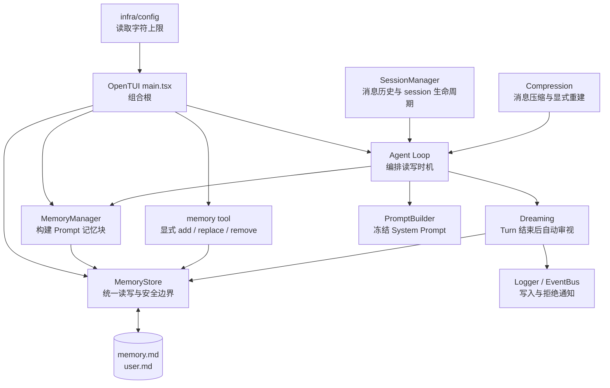
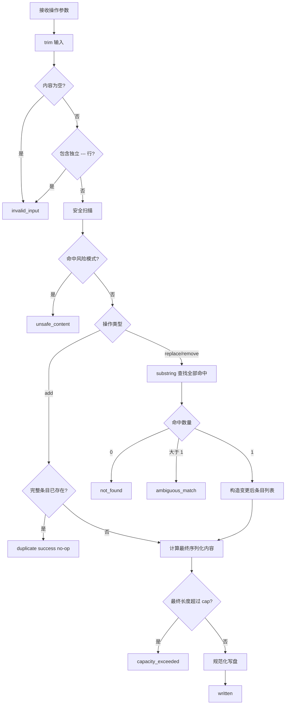
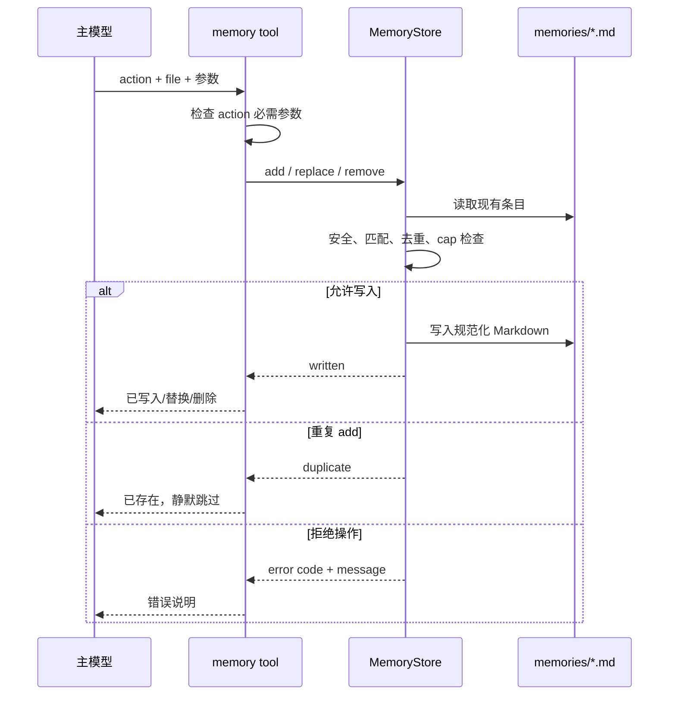
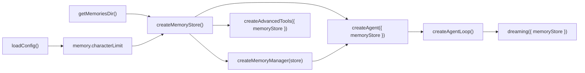

# Vivlos Memory 模块技术文档

## 1. 模块目标

我们用 Memory 模块保存需要跨 session 持续生效的少量关键信息，包括项目事实、环境约定、决策经验、用户画像和沟通偏好。

Memory 不是完整对话历史，也不是无限增长的知识库。它是进入 System Prompt 的有界长期上下文，因此每一条内容都需要经过筛选、安全检查和容量控制。

我们遵守以下五条核心约束：

| 约束 | 含义 |
|------|------|
| File-first | 记忆以 Markdown 文件持久化，可直接阅读、编辑和审计 |
| Bounded | 每个文件有字符上限，长期 Prompt 成本不会无限增长 |
| Single Write Gateway | 所有程序化写入统一经过 `MemoryStore` |
| Safe by Default | 写盘前统一检查恶意指令、凭证、隐藏字符和格式边界 |
| Frozen Snapshot | Memory 在 System Prompt 中以 session 快照存在，常规写盘不刷新当前缓存 |

当前模块实现的是 L1 Markdown Memory。会话全文检索、外部记忆服务和大型知识库不属于当前运行路径。

---

## 2. 整体架构

Memory 由配置、存储、Prompt 读取、显式工具和自动审视五部分组成。组合根在进程启动时创建唯一的 `MemoryStore`，随后把它注入所有需要读写记忆的组件。



### 2.1 组件职责

| 组件 | 负责 | 不负责 |
|------|------|--------|
| `MemoryStore` | Markdown 解析、序列化、CRUD、用量、安全检查、容量检查 | Prompt 格式、模型调用、UI 文案 |
| `MemoryManager` | 从 Store 读取内容，构造注入 System Prompt 的 Memory block | 写入和安全检查 |
| `memory tool` | 接收模型参数，调用 Store，格式化 tool result | 直接读写文件 |
| `Dreaming` | 调用模型审视本轮内容，将候选条目交给 Store | 绕过 Store 写盘、修改当前 SP |
| `PromptBuilder` | 缓存并返回冻结的 System Prompt | 持久化 Memory |
| `Agent Loop` | 决定何时读取、冻结、落盘和启动 Dreaming | 实现具体文件规则 |
| `infra/config` | 提供启动期字符上限 | 动态监听配置和文件读写 |
| `main.tsx` | 创建实例并注入依赖 | 承担 Memory 业务规则 |

---

## 3. 文件位置与数据格式

### 3.1 运行时路径

当前 `.vivlos` 根目录基于 `process.cwd()`：

```text
<cwd>/.vivlos/
  config.json
  memories/
    memory.md
    user.md
  sessions/
  tasks/
```

因此，从不同工作目录启动 Vivlos 会使用不同的 Memory 命名空间。

### 3.2 两类记忆

| 文件 | 内容 |
|------|------|
| `memory.md` | 项目事实、运行环境、技术决策、约定和可复用经验 |
| `user.md` | 用户身份、偏好、沟通方式和长期目标 |

类型层使用以下文件标识：

```ts
type MemoryFile = "memory" | "user";
```

Store 根据受限联合类型映射固定文件名，不接受任意路径。

### 3.3 Markdown 格式

每条记忆是一段独立文本，条目之间使用独立的 `---` 行分隔：

```markdown
项目使用 Bun 作为运行时和包管理器。
---
Memory 写入必须经过统一安全扫描。
---
当前主要入口是 OpenTUI。
```

序列化规则如下：

1. 每个输入条目先执行 `trim()`。
2. 非空条目使用 `\n---\n` 连接。
3. 非空文件以一个换行结尾。
4. 空列表写成真正的空文件，不保留占位换行。
5. cap 和 usage 都按最终序列化结果的字符数计算。

---

## 4. 配置

Memory 字符上限注册在 `<cwd>/.vivlos/config.json`：

```json
{
  "memory": {
    "characterLimit": {
      "memory": 2200,
      "user": 1375
    }
  }
}
```

### 4.1 加载规则

| 情况 | 行为 |
|------|------|
| 配置文件不存在 | `ensureConfig()` 生成完整默认配置 |
| 只配置一个文件上限 | 已配置字段生效，另一个字段继承默认值 |
| 值为零、负数、小数或非数字 | 对应字段回退默认值 |
| JSON 无法解析 | 整体回退默认配置 |
| 运行中修改配置 | 当前进程不热更新，下次启动时生效 |

`main.tsx` 在启动时读取配置，并用同一份 `characterLimit` 创建 Store：

```text
loadConfig()
  -> config.memory.characterLimit
  -> createMemoryStore(memoriesDir, limits)
  -> createMemoryManager(memoryStore)
  -> 注入 memory tool 与 Agent Loop
```

这样，写入检查、Prompt header 和未来 SideBar 用量展示都能使用同一套 cap。

---

## 5. MemoryStore

`MemoryStore` 是 Markdown Memory 的唯一程序化读写入口。

```ts
interface MemoryStore {
  read(file: MemoryFile): string[];
  add(file: MemoryFile, content: string): MemoryMutationResult;
  replace(file: MemoryFile, oldText: string, newText: string): MemoryMutationResult;
  remove(file: MemoryFile, oldText: string): MemoryMutationResult;
  getUsage(file: MemoryFile): MemoryUsage;
}
```

### 5.1 统一写入管线



### 5.2 `read`

`read(file)` 读取固定 Markdown 文件，将内容拆成规范化条目数组。

- 文件不存在时返回空数组。
- 空文件返回空数组。
- 每条内容会被 trim。
- 空条目会被过滤。

读取不会创建目录或文件。

### 5.3 `add`

`add` 用于新增完整、独立的记忆。

执行顺序：

1. 规范化并验证内容。
2. 执行安全扫描。
3. 检查是否存在完全相同的条目。
4. 计算追加后的完整序列化长度。
5. 未超过 cap 时写盘。

完全相同的条目返回成功结果，状态为 `duplicate`，但不会再次写入。这让模型重试保持幂等。

### 5.4 `replace`

`replace` 使用 `oldText` 对每条记忆执行 substring 匹配。

- 零条命中返回 `not_found`。
- 多条命中返回 `ambiguous_match`。
- 只有唯一命中时才执行替换。
- `oldText` 和 `newText` 都必须非空。
- 替换后的完整条目会重新进行安全扫描。
- 替换后的完整文件会重新进行 cap 检查。

如果需要删除整条记忆，应调用 `remove`，不使用空字符串替换。

### 5.5 `remove`

`remove` 与 `replace` 使用相同的唯一 substring 匹配规则。唯一命中后删除整条记忆，而不是只删除命中的局部文本。

删除最后一条记忆后，Store 会把文件写成空内容。

### 5.6 `getUsage`

`getUsage(file)` 返回：

```ts
interface MemoryUsage {
  used: number;
  cap: number;
}
```

`used` 基于规范化序列化结果，不依赖文件中多余的首尾空白。`cap` 来自启动时加载的配置。

### 5.7 操作结果

Store 使用判别联合返回业务结果：

```ts
type MemoryMutationResult =
  | { ok: true; value: MemoryMutation }
  | { ok: false; error: MemoryStoreError };
```

成功状态包括：

| 状态 | 含义 |
|------|------|
| `written` | 文件已经发生有效变更 |
| `duplicate` | add 内容已存在，成功但未写盘 |

错误码包括：

| 错误码 | 含义 |
|--------|------|
| `invalid_input` | 空内容、空匹配文本或分隔符注入 |
| `unsafe_content` | 命中恶意指令、凭证或隐藏字符 |
| `not_found` | replace/remove 没有找到目标条目 |
| `ambiguous_match` | substring 同时命中多条记忆 |
| `capacity_exceeded` | 变更后的最终文件超过字符上限 |

文件系统异常不转换成业务错误。调用方可以按自身职责决定是向模型返回错误，还是降级并记录日志。

---

## 6. 安全边界

Memory 内容会进入未来 session 的 System Prompt。一次恶意写入可能持续影响后续对话，因此安全检查位于 Store 内部，而不是只放在 tool 层。

### 6.1 Prompt injection

Store 拦截常见的角色覆盖和指令忽略模式，包括：

- 忽略先前 instructions、prompts 或 rules。
- 重新声明 `you are now`。
- 使用 `system:` 伪造高优先级内容。
- 注入 `[INST]`、`<<SYS>>`、`<|im_start|>` 等控制标记。

### 6.2 凭证

Store 拦截常见敏感内容，包括：

- SSH 私钥头。
- `sk-` 形式的长密钥。
- `api_key`、`password`、`secret` 赋值。
- AWS Access Key ID。

Memory 不是凭证存储。认证信息应继续由 credential store 管理。

### 6.3 不可见 Unicode

零宽字符、方向控制字符和部分特殊分隔字符难以被人眼审计，却可能改变模型看到的内容。Store 在写盘前拒绝这些字符。

### 6.4 Markdown 分隔符

输入内容不能包含独立的 `---` 行。否则一条逻辑记忆会在下次读取时变成多条，破坏去重、匹配和 cap 语义。

### 6.5 容量边界

Store 不会为了写入而静默截断内容。超过 cap 时返回错误，由模型决定删除、替换或精简已有条目。

`MemoryManager` 仍保留读取侧的防御性裁剪：如果用户手动编辑文件造成超限，Manager 会优先移除前面的旧条目，并在单条内容仍过大时截断 Prompt 输出。磁盘原文不会被 Manager 修改。

人工直接编辑 Markdown 不经过 Store 安全扫描。这是 File-first 提供的显式管理入口，操作者需要对写入内容负责；下一次 Prompt 重建时，Manager 会按磁盘原文读取这些条目。

---

## 7. 显式写入：memory tool

memory tool 暴露给主模型，支持 `add`、`replace` 和 `remove`，不提供 `read`。

我们不提供 `read` 的原因是：session 启动时，Memory 已经通过 `MemoryManager` 注入 System Prompt。Tool 的职责是改变未来快照，不是重复读取当前快照。



memory tool 不持有路径、cap、安全正则或文件 API。这样，任何新增写入入口都无法通过复用 tool 外观来绕过底层规则。

---

## 8. 自动写入：Dreaming

Dreaming 是每个成功 Turn 结束后的记忆审视步骤。主回复和 session 消息已经生成后，Dreaming 再检查本轮新增消息是否包含值得长期保存的信息。

### 8.1 Save / Skip

Dreaming Prompt 将内容分成两类：

| Save | Skip |
|------|------|
| 用户偏好 | 琐碎问题 |
| 环境信息 | 可搜索事实 |
| 重要事实 | 原始数据堆积 |
| 用户纠正 | session 特有的随机内容 |
| 工作约定 | 一次性细节 |
| 已完成工作 | |
| 用户明确要求记住 | |

模型输出统一 JSON：

```json
{
  "entries": [
    {
      "file": "memory",
      "content": "项目使用 Bun 作为运行时。"
    }
  ]
}
```

没有可保存内容时返回：

```json
{"entries": []}
```

### 8.2 执行时序

```mermaid
sequenceDiagram
    participant Loop as Agent Loop
    participant Dream as Dreaming
    participant LLM as 审视模型
    participant Store as MemoryStore
    participant Disk as memories/*.md
    participant Log as Logger/EventBus

    Loop->>Dream: 本轮新增 messages + model + Store
    Dream->>LLM: Save/Skip Prompt + 对话文本
    LLM-->>Dream: text_delta 流
    Dream->>Dream: 拼接文本并解析 JSON
    alt entries 为空或 JSON 无效
        Dream-->>Loop: 跳过
    else 存在候选条目
        loop 每条候选记忆
            Dream->>Store: add(file, content)
            Store->>Store: 执行统一安全与 cap 检查
            alt written
                Store->>Disk: 写盘
                Dream->>Dream: written + 1
            else duplicate
                Store-->>Dream: 成功 no-op
            else rejected
                Store-->>Dream: error
                Dream->>Log: warning + 拒绝原因
            end
        end
        Dream->>Log: 仅报告真实写入数量
    end
    Dream-->>Loop: 完成，不返回对话消息
```

### 8.3 失败隔离

Dreaming 包裹完整的 `try/catch`：

- 模型调用失败不会撤销主回复。
- 非法 JSON 视为没有可保存条目。
- 单条记忆被 Store 拒绝时继续处理剩余条目。
- duplicate 不产生错误，也不计入写入数量。
- 只有真实写盘数量大于零时才发送成功通知。

Dreaming 当前使用本轮主模型，并等待审视完成后才让 `AgentLoop.run()` 返回。

---

## 9. MemoryManager 与 Prompt 格式

`MemoryManager` 只负责把 Store 中的条目格式化为 Prompt 内容。

### 9.1 构建规则

1. 分别读取 `memory` 和 `user` 条目。
2. 空文件不生成对应 Prompt block。
3. 非空条目保持 `---` 分隔。
4. 使用 `MemoryStore.getUsage()` 取得统一的 used/cap。
5. 用量超过 50% 时在 header 展示百分比和字符数。

生成内容示例：

```text
══════════════════════════════════════════
MEMORY (agent notes) [68% — 1,496/2,200 chars]
══════════════════════════════════════════
项目使用 Bun 作为运行时。
---
Memory 写入必须经过统一 Store。

══════════════════════════════════════════
USER PROFILE
══════════════════════════════════════════
用户偏好清晰、直接的技术说明。
```

`PromptBuilder` 会把整段内容包裹在 `<memory>` XML 节点中，再与 identity、environment、skills、compacted history 和 rules 一起组装 System Prompt。

---

## 10. Frozen Snapshot

Memory 磁盘状态和 System Prompt 快照是两个不同状态：

- Store 表示磁盘上的 live state。
- PromptBuilder cached SP 表示当前 session 使用的 snapshot。

### 10.1 常规生命周期

```mermaid
sequenceDiagram
    participant Session as Session
    participant Loop as Agent Loop
    participant Manager as MemoryManager
    participant Store as MemoryStore
    participant Prompt as PromptBuilder
    participant Tool as memory tool / Dreaming
    participant Disk as memories/*.md

    Session->>Loop: 首个 Turn
    Loop->>Prompt: isFrozen()
    Prompt-->>Loop: false
    Loop->>Manager: buildPrompt()
    Manager->>Store: read(memory/user)
    Store->>Disk: 读取 Markdown
    Store-->>Manager: 条目 + usage
    Manager-->>Loop: Memory block
    Loop->>Prompt: setMemory() + freeze()

    Note over Prompt: 当前 session 的 System Prompt 快照

    Loop->>Tool: 后续 Turn 中产生记忆写入
    Tool->>Store: add / replace / remove
    Store->>Disk: 磁盘立即更新

    Note over Disk,Prompt: live state 已更新，cached SP 保持不变

    Session->>Loop: 新 session 首个 Turn
    Loop->>Prompt: isFrozen() = false
    Loop->>Manager: buildPrompt()
    Manager->>Disk: 读取更新后的 Markdown
    Loop->>Prompt: freeze 新快照
```

### 10.2 快照失效时机

常规 memory tool 和 Dreaming 写盘不会调用 `PromptBuilder.invalidate()`。快照在以下路径失效：

| 路径 | 行为 |
|------|------|
| 切换 session | 重置 compression 状态并 invalidate |
| 新建 session | 重置 compression 状态并 invalidate |
| 自动 compression 成功 | 更新 compacted history 并 invalidate |
| 手动 `/compact` 成功 | 更新 compacted history 并 invalidate |

Session 切换或新建后，下一次 Lazy Freeze 自然读取新的 Memory。

Compression 是一个显式重建例外：同一 session 内压缩成功后，下一次 Lazy Freeze 会重新调用 `MemoryManager.buildPrompt()`，因此可能读取到本 session 之前已经写盘的新记忆。

所以，准确规则是：

> Memory 写盘本身不会刷新当前 System Prompt；只有 session 生命周期变化或其他模块显式 invalidate，下一次构建才会读取磁盘 live state。

---

## 11. 完整 Turn 时序

下面的时序把 Compression、Frozen Snapshot、主模型工具循环、Session 持久化和 Dreaming 放在同一条执行链上。

```mermaid
sequenceDiagram
    actor User
    participant Loop as Agent Loop
    participant Comp as Compression
    participant Session as SessionManager
    participant Manager as MemoryManager
    participant Store as MemoryStore
    participant Prompt as PromptBuilder
    participant LLM as 主模型
    participant Tool as Tools
    participant Dream as Dreaming
    participant Log as Logger/EventBus

    User->>Loop: 输入一条消息
    Loop->>Comp: 检查 context 用量
    alt 达到压缩条件
        Comp->>Session: replaceMessages()
        Comp->>Prompt: setCompactedHistory() + invalidate()
    end

    Loop->>Prompt: isFrozen()
    alt SP 尚未冻结或已失效
        Loop->>Manager: buildPrompt()
        Manager->>Store: read + getUsage
        Store-->>Manager: memory/user 条目
        Manager-->>Loop: Memory block
        Loop->>Prompt: setMemory() + freeze()
    end

    Loop->>Prompt: getCached()
    Prompt-->>Loop: Frozen System Prompt
    Loop->>LLM: SP + session history + 当前输入

    loop 模型工具内循环
        LLM->>Tool: tool call
        alt 调用 memory tool
            Tool->>Store: 安全 CRUD
            Store-->>Tool: mutation result
        end
        Tool-->>LLM: tool result
    end

    LLM-->>Loop: 最终回复与本轮新增消息
    Loop->>Session: appendMessage()
    Loop->>Dream: 审视本轮新增消息
    Dream->>LLM: Save/Skip 请求
    LLM-->>Dream: JSON entries
    Dream->>Store: 对每条候选执行 add
    Store-->>Dream: written / duplicate / error
    Dream->>Log: 实际写入或拒绝信息
    Loop-->>User: run() 完成
```

当前实现中，Dreaming 位于 `run()` 返回之前，因此 UI 可能已经收到主回复流，但调用仍需等待 Dreaming 完成。

---

## 12. 与其他模块的边界

### 12.1 SessionManager

SessionManager 保存完整消息历史，并把消息追加到 session JSONL。它解决“这次会话发生过什么”，Memory 解决“哪些少量事实值得在未来持续出现”。

Session 历史可以很长并被压缩；Memory 体积固定且直接进入 System Prompt。二者不能互相替代。

### 12.2 Compression

Compression 处理消息历史，不直接修改 `memory.md` 或 `user.md`。压缩成功后，它会更新 compacted history 并使 PromptBuilder 缓存失效。

这个显式失效会间接触发 Memory 重读，因此 Compression 与 Frozen Snapshot 在 Prompt 重建点相交。

### 12.3 PromptBuilder

PromptBuilder 只保存当前进程中的 System Prompt 缓存。它不知道 Memory 的文件路径、安全规则和字符上限。

MemoryManager 将格式化后的字符串交给 `setMemory()`，PromptBuilder 再负责 XML 包裹、段落顺序和 freeze/invalidate。

### 12.4 Tool System

Tool System 让主模型显式管理记忆。memory tool 是 Store 的调用适配器，与 bash、file、skill 等其他工具一起进入 `AgentContext.tools`。

Tool 返回会进入当前消息历史，因此模型在同一个 Turn 内能看到写入结果。它看到的是 live operation result，不是已经刷新的 System Prompt。

### 12.5 Logger 与 EventBus

Dreaming 使用 `log()` 报告真实写入数量和安全拒绝原因。Logger 将需要展示的消息送入 EventBus，由 TUI 通知层消费。

Store 本身不依赖 UI，也不主动发事件。这样 Store 可以在测试、其他入口和未来后台任务中复用。

### 12.6 SQLite

当前 Memory 运行路径不读取或写入 SQLite。旧 Memory repository 已停止导出，也不会执行旧数据迁移。

SQLite 仍用于其他基础设施数据，因此不能通过删除整个数据库来清理旧 Memory。废弃的 Memory repository 源文件会单独移除，不增加自动 `DROP TABLE` 行为。

---

## 13. 组合根与依赖注入

`main.tsx` 按以下顺序装配 Memory：



Store 是进程内单例。MemoryManager、memory tool 和 Dreaming 共享同一个实例，因此它们看到相同目录和相同 cap。

我们不在各组件内部重新调用 `createMemoryStore()`，避免配置漂移和安全规则分叉。

---

## 14. 验证策略

Memory 的验证分成三个层次。

### 14.1 MemoryStore 单元测试

需要覆盖：

- add 正常写入和规范化格式。
- duplicate success no-op。
- 恰好达到 cap 与超过 cap。
- prompt injection、凭证和不可见 Unicode。
- 独立 `---` 分隔行。
- replace 零命中、多命中、唯一命中和替换后超限。
- remove 最后一条后生成空文件。
- usage 与最终序列化长度一致。

### 14.2 Dreaming 测试

通过 fake LLM stream 覆盖：

- Save JSON 写入正确文件。
- Skip JSON 不写盘。
- 非法 JSON 静默跳过。
- 危险候选被 Store 拒绝。
- duplicate 和 over-cap 不误报写入数量。
- 模型异常不会让主流程抛错。

### 14.3 Frozen Snapshot 集成测试

确定性测试流程：

1. 写入初始 Memory。
2. `MemoryManager.buildPrompt()` 后 freeze。
3. 通过 Store 修改磁盘。
4. 验证 `PromptBuilder.getCached()` 仍返回旧快照。
5. invalidate 并重新 build/freeze。
6. 验证新快照包含修改后的内容。

测试不依赖模型回答“是否记得”，只比较实际 Prompt 字符串和磁盘状态。

---

## 15. 当前边界

当前实现具有以下明确边界：

| 边界 | 当前行为 |
|------|----------|
| 文件 I/O | 使用同步 Node.js 文件 API |
| 并发 | 没有跨进程锁和并发写事务 |
| 原子写入 | 当前直接覆盖目标 Markdown 文件 |
| Dreaming 模型 | 使用当前主对话模型 |
| Dreaming 延迟 | `AgentLoop.run()` 等待审视结束 |
| 配置更新 | 仅进程启动时读取 |
| 旧数据 | 不迁移旧 SQLite Memory |
| 全文历史召回 | 尚未实现 Session Search |
| 外部记忆服务 | 不在当前模块中 |

这些边界不会改变当前 L1 Memory 的核心契约：所有程序化写入经过同一个 Store，常规写盘不刷新当前快照，自动沉淀的记忆必须经过筛选、安全检查和容量控制。
