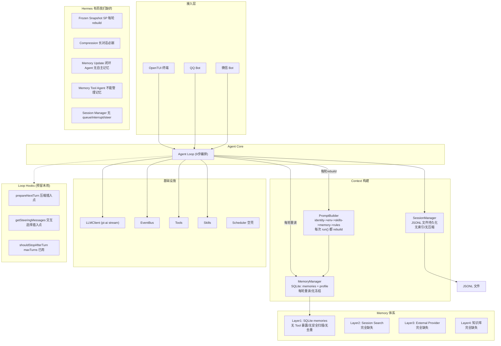
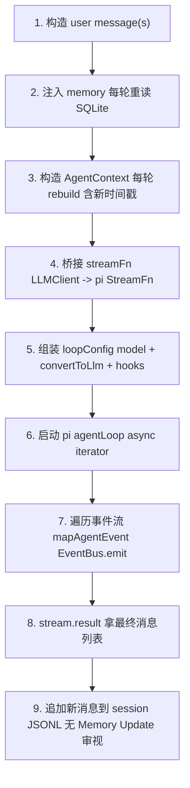
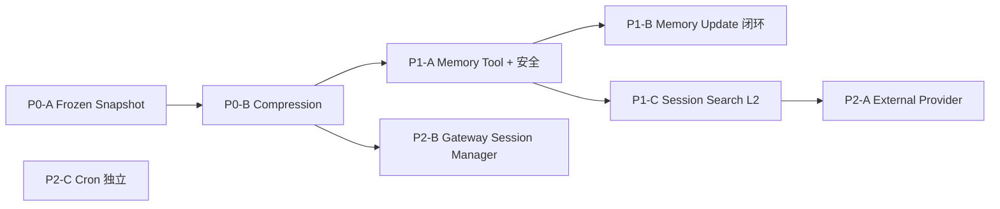

# Vivlos Agent 架构图与 Hermes 对比分析

> 基于 `01-arch.md`（Hermes 架构详解）和 `02-memory.md`（Hermes Memory 四层体系）的深度研读，
> 对比 vivlos agent 现有架构，分析差距与可引入的机制。

---

## 一、Hermes 核心设计思想提炼

Hermes 的设计哲学可以浓缩为**三个核心洞察**：

### 1. Session vs Turn 两层时间尺度（灵魂设计）

```
Session 启动 -> 读盘 -> 组装 SP -> 冻结快照（frozen snapshot）
                                    ↓
Turn 1 -> 复用冻结SP + 历史消息 -> LLM -> 回复 -> 写盘（SP不变）
Turn 2 -> 复用冻结SP + 历史消息 -> LLM -> 回复 -> 写盘（SP不变）
  ...
Session 结束 / 新Session -> 重读盘 -> 新快照
```

**为什么冻结**：保 provider 侧 prompt prefix cache + 避免每轮重读盘抖动前缀。
写入 memory 后当前 session 看不到（靠 tool result 看 live 状态），下个 session 才进 SP。
**用新鲜度换速度/成本**。

### 2. Memory 不是单点，是四层叠加

| 层 | 形态 | 时机 | 解决什么 |
|----|------|------|---------|
| L1 | memory.md + user.md（有界） | Session启动冻结进SP | 关键事实常驻 |
| L2 | state.db FTS5 全文索引 | 每Turn落库，Agent自主搜索 | "上周聊过X吗" |
| L3 | External Provider（mem0等） | per-turn prefetch/sync + session-end extract | 语义召回/身份建模 |
| L4 | Obsidian Skill | 按需 | 项目级结构化知识库 |

**关键原则：四层 additive（叠加）不是 alternative（互斥）**。L1 配了 Provider 也不关。

### 3. Memory 的"隐形安全设计"才是它能用的关键

纸面上"两个 md + 2200 字符 + 无向量库"不该好用，但四个约束撑住了：

- **Cap as Feature**：硬上限逼 agent 策展（curate），不是 junk drawer
- **Duplicate = No-op**：LLM 爱 retry，重复 add 不报错但静默不插入
- **Injection Scanning**：写入前扫描 prompt injection / credential exfiltration
  （memory 进每个未来 session 的 SP，攻击面极大）
- **Save/Skip Policy**：出厂带"什么该记什么该跳过"，不需要额外 memory manager agent

---

## 二、Vivlos Agent 现有架构图



### Agent Loop 9 步详解（当前实现）




---

## 三、逐项对比分析

### 3.1 System Prompt 冻结（最大架构差异）

| 维度 | Hermes | Vivlos |
|------|--------|--------|
| SP 组装时机 | Session 启动**一次** | 每次 run() **每轮** |
| Memory 读取 | 启动时读一次冻结 | 每轮 buildPrompt() 重读 SQLite |
| Environment | 启动时生成冻结 | 每轮 getEnvironmentValues() 重新生成时间戳 |
| Prompt Cache | 充分利用 | 每轮 SP 都变，cache 完全失效 |

**影响**：
- `agent-loop.ts:74-78` 每轮都 setMemory("") + buildPrompt() + setMemory(block)
- `builder.ts:94` 每轮都 getEnvironmentValues() 生成新时间戳
- 每轮 SP 都不同 -> provider prompt cache 失效 -> 长会话成本炸

### 3.2 Compression（完全缺失 vs 完整流水线）

| 维度 | Hermes | Vivlos |
|------|--------|--------|
| 触发 | 50% 阈值 + 85% 安全网 + 报错强制 | 无 |
| 算法 | 剪枝 -> 定边界(head/middle/tail) -> 结构化摘要 -> 组装 | 无 |
| 摘要格式 | 8 段结构化 + 增量更新 | 无 |
| 失败处理 | 连续两次无效暂停 + 兜底摘要 | 无 |
| 插入点 | - | prepareNextTurn hook 已预留 |
| 持久化 | - | session JSONL 格式已预留 compaction entry |

### 3.3 Memory 体系（只有 L1 雏形）

| 层 | Hermes | Vivlos | 差距 |
|----|--------|--------|------|
| L1 | memory.md + user.md，frozen snapshot，cap，dedup，injection scan | SQLite memories + profile，有 cap 软上限 | 无冻结、无 Tool、无 dedup、无 injection scan |
| L2 | state.db FTS5 全文索引 + session_search 工具 + Flash 摘要 | JSONL 无索引 | 完全缺失 |
| L3 | Provider ABC + plugin loader + 五件套 | 无插件架构 | 完全缺失 |
| L4 | Obsidian Skill | 无 | 完全缺失 |

### 3.4 Memory Update 闭环（完全缺失）

Hermes Loop 末尾有一步 Memory Update：审视本轮，判断有没有值得记住的内容。

```
Hermes Loop: ... -> 最终回复 -> Memory Update 审视 -> 可能写 user.md/memory.md
Vivlos Loop: ... -> 最终回复 -> 追加消息到 session（无审视）
```

`agent-loop.ts:135-144` 只做消息追加，无任何 memory 审视。Agent 没有自主记忆能力。

### 3.5 Memory Tool 安全设计

| 安全特性 | Hermes | Vivlos |
|---------|--------|--------|
| Cap as Feature | 硬上限，超限报错逼策展 | 有 MAX_MEMORY_CHARS 但只是软裁剪，不报错 |
| Duplicate No-op | 静默去重 | 直接插入重复内容 |
| Injection Scanning | 写入前扫描 | 无 |
| Save/Skip Policy | 出厂带策略 | 无 |
| substring 匹配 | replace/remove 用子串匹配，多条命中报错 | 精确匹配（脆弱） |

### 3.6 Gateway / Session Manager / Cron

| 维度 | Hermes | Vivlos |
|------|--------|--------|
| 多渠道 | Telegram/Email/Slack/Discord/WhatsApp/SMS | QQ/微信 |
| 历史拉取 | 按 session key 从 SQLite 拉 | JSONL 内存读取 |
| 并发控制 | queue/interrupt/steer | 无 |
| Cron | 每分钟 tick + jobs.json + Home 通知 | scheduler 空壳 |


---

## 四、建议引入的机制（按优先级）

### P0：保命级（不补会崩）

| 机制 | 参照 Hermes | 改动范围 | 理由 |
|------|------------|---------|------|
| **Frozen Snapshot** | 01-arch S3.2 | PromptBuilder + agent-loop | 每轮 rebuild SP 浪费 cache + 成本炸；最大架构债 |
| **Compression** | 01-arch S4 | prepareNextTurn hook + session JSONL | 长对话必崩；hook 和 entry 格式已预留 |

### P1：能力级（补了质变）

| 机制 | 参照 Hermes | 改动范围 | 理由 |
|------|------------|---------|------|
| **Memory Update 闭环** | 01-arch S2.1 步骤8 + S6.4 | agent-loop 末尾加审视步骤 | Agent 无自主记忆=无学习能力 |
| **Memory Tool + 安全设计** | 02-memory S1.4-1.5 | 新增 tool + manager 增强 | Cap/Dedup/Injection Scan 是 memory 能用的前提 |
| **Session Search (L2)** | 02-memory S2 | SQLite FTS5 + session_search tool | "上次聊过X吗"是高频需求 |

### P2：增强级（锦上添花）

| 机制 | 参照 Hermes | 改动范围 | 理由 |
|------|------------|---------|------|
| **External Provider 架构** | 02-memory S3 | Provider ABC + plugin loader | mem0 等接入，待定 |
| **Gateway Session Manager** | 01-arch S5.4 | entries 层增强 | queue/interrupt/steer |
| **Cron** | 01-arch S7 | infra/scheduler 填充 | 定时任务 |

---

## 五、Frozen Snapshot 改造思路（P0 最重要）

### Hermes 的做法

```
Session 启动:
  1. 读 memory.md + user.md
  2. 读 SOUL + Project Context
  3. 组装 SP = stable + context + volatile
  4. 冻结 = cachedSystemPrompt

每轮 Turn:
  1. 复用 cachedSystemPrompt（不 rebuild）
  2. 消息历史 + 本轮消息
  3. 可选 compression
  4. 调 LLM

刷新时机: 新 Session 启动 / compression 触发的 explicit rebuild
```

### Vivlos 改造方案

```
当前 (每轮 rebuild):
  agent-loop.run() 每次:
    promptBuilder.setMemory("")
    memoryManager.buildPrompt()
    promptBuilder.setMemory(block)
    promptBuilder.build()

改为 (Session 级冻结):
  Session 启动时（createAgent / switchSession / createNewSession）:
    1. memoryManager.buildPrompt() -> promptBuilder.setMemory()
    2. promptBuilder.build() -> 冻结为 cachedSystemPrompt
  
  Turn run() 时:
    1. 复用 cachedSystemPrompt（不 rebuild）
    2. 只组装 messages + tools
    3. compression 检查（若触发则 explicit rebuild）
```

### 关键改动点

| 文件 | 改动 |
|------|------|
| `agent/prompt/builder.ts` | 加 freeze() / getCached() / rebuild() 方法；build() 改为返回缓存 |
| `agent/prompt/types.ts` | PromptBuilder 接口加冻结相关方法 |
| `agent/loop/agent-loop.ts:74-82` | 不再每轮 build，改读 promptBuilder.getCached() |
| `agent/index.ts` | switchSession / createNewSession 触发 promptBuilder.freeze() |
| `agent/loop/agent-loop.ts` | compression 触发时调 promptBuilder.rebuild()（explicit rebuild） |

### Environment 时间戳问题

当前 getEnvironmentValues() 每轮生成新时间戳，导致 SP 每轮都变。
冻结后时间戳固定在 Session 启动时刻。若需要实时时间，改为：

- 方案 A：时间戳进 SP 冻结（Hermes 做法），agent 靠 tool 获取当前时间
- 方案 B：时间戳不放 SP，改为每轮注入 user message 前缀（ephemeral overlay）

建议方案 A（与 Hermes 一致，最简）。

---

## 六、Compression 改造思路（P0 第二）

### Hermes 压缩算法

```
消息列表 -> 1.廉价剪枝 -> 2.定边界(head/middle/tail) -> 3.辅助模型摘要 -> 4.组装
```

| 步骤 | 做什么 |
|------|--------|
| 1.剪枝 | 尾部保护区外：长 tool 结果收成一行；重复去重；大参数截断 |
| 2.定边界 | 算 head/middle/tail；保证 tool 调用和结果不被拆 |
| 3.摘要 | 辅助模型按固定模板总结 middle；已有摘要则增量更新 |
| 4.组装 | head + 摘要消息 + tail；清掉无配对 tool 消息 |

### Hermes 摘要结构（8 段）

| 区块 | 作用 |
|------|------|
| Historical Task Snapshot | 用户最近未完成的输入（尽量原文） |
| Goal / Constraints & Preferences | 总目标、约束与偏好 |
| Completed Actions | 编号：做了什么、路径/命令、结果、用了哪个工具 |
| Active State | 工作目录、分支、改动文件、测试状态等 |
| Historical In-Progress / Blocked | 压缩当时进行中的事、阻塞与报错 |
| Key Decisions / Resolved Questions | 关键决策、已回答过的问题 |
| Historical Pending Asks / Remaining Work | 陈旧待办--默认不要自动接着做 |
| Relevant Files / Critical Context | 相关文件与关键值（密钥写成 REDACTED） |

### Vivlos 改造方案

```
prepareNextTurn hook:
  1. 估算 token 用量（API usage 或粗估）
  2. 若 >= contextWindow * 0.5:
     a. 廉价剪枝（清旧 tool 输出）
     b. 定边界（head/middle/tail）
     c. 辅助模型写结构化摘要
     d. 组装新消息列表
     e. session JSONL 写 compaction entry
     f. explicit rebuild SP
  3. 返回处理后的消息
```

### 配置（参考 Hermes）

```yaml
compression:
  threshold: 0.50       # 触发比例
  target_ratio: 0.20    # 近期消息保留预算
  protect_last_n: 20    # 尾部至少保留多少条
```

---

## 七、Memory 改造思路（P1）

### Memory Tool 暴露

参照 Hermes memory tool，实现 add/replace/remove 三种动作：

```
agent/tools/memory-tool.ts:
  - add(content): 追加条目，用 § 分隔
  - replace(old_text, new_text): substring 匹配替换
  - remove(old_text): substring 匹配删除
  
安全设计:
  - 写入前 Injection Scanning
  - Duplicate = Success No-op
  - 超过 cap 报错（逼策展）
  - substring 多条命中报错
```

### Memory Update 闭环

在 agent-loop.ts 步骤 9 之后加一步：

```
9. 追加新消息到 session
10. Memory Update 审视（新增）
    - 审视本轮对话
    - 判断有没有值得记住的内容
    - 有料则调 memory tool 写盘
    - 无料则跳过
```

可由 agent 自主调用 memory tool 实现，或在 loop 末尾加一个自动审视步骤。

### Session Search (L2)

```
infra/storage/session/:
  - 新增 FTS5 索引表（session_id, content, created_at）
  - 每次 appendMessage 时同步写入索引
  - 新增 session_search tool
  - 返回结果加摘要（可选）
```

---

## 八、依赖关系与实施顺序



| 阶段 | 机制 | 前置依赖 |
|------|------|---------|
| P0-A | Frozen Snapshot | 无（改 PromptBuilder + agent-loop） |
| P0-B | Compression | P0-A（压缩后需 explicit rebuild SP） |
| P1-A | Memory Tool | P0-A（Tool 写盘后下个 session 才进冻结 SP） |
| P1-B | Memory Update 闭环 | P1-A（审视后调 memory tool 写盘） |
| P1-C | Session Search | 无（独立索引层） |
| P2-* | 增强 | 各自前置完成 |
